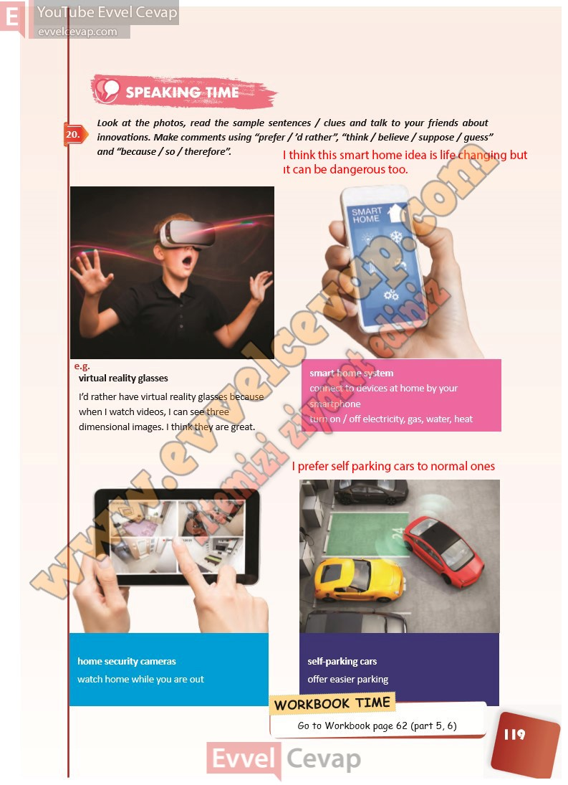

# 10. Sınıf İngilizce Ders Kitabı Cevapları Pasifik Yayınları Sayfa 119

---

**Soru: Look at the photos, read the sample sentences / clues and talk to your friends about innovations. Make comments using “prefer / ’d rather”, “think / believe / suppose / guess” and “because / so / therefore”.**

-   **Cevap**:

