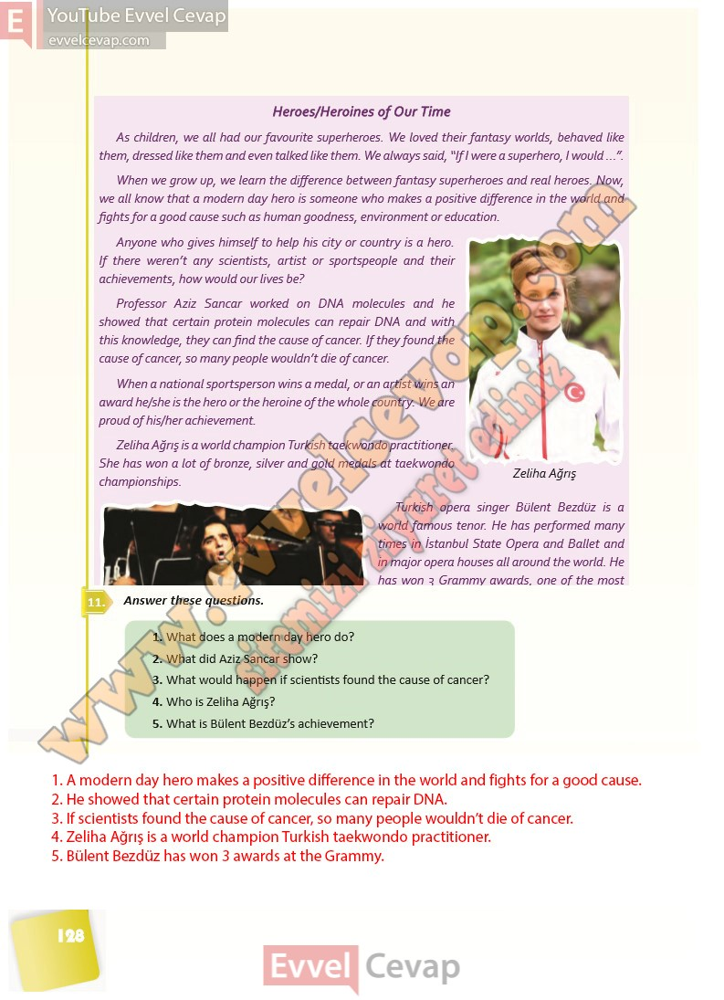

# 10. Sınıf İngilizce Ders Kitabı Cevapları Pasifik Yayınları Sayfa 128

---

Heroes/Heroines of Our Time

 As children, we all had our favourite superheroes. We loved their fantasy worlds, behaved like them, dressedlike them andeven talkedlike them. We always said, “If I were a superhero, I would…”.

 When we grow up, we learn the difference between fantasy superheroes and real heroes. Now, we all know that a modern day hero is someone who makes a positive difference in the world and fights for a good cause such as human goodness, environment or education.

 Anyone who gives himself to help his city or country is a hero.

 If there weren’t any scientists, artist or sportspeople and their achievements, how would our lives be?

 Professor Aziz Sancar worked on DNA molecules and he showed that certain protein molecules can repair DNA and with this knowledge, they can find the cause of cancer. If they found the cause of cancer, so many people wouldn’t die of cancer.

 When a national sportsperson wins a medal, or an artist wins an award he/she is the hero or the heroine of the whole country. We are proud of his/her achievement.

 Zeliha Ağrış is a world champion Turkish taekwondo practitioner.

 She has won a lot of bronze, silver and gold medals at taekwondo championships.

 Turkish opera singer Bülent Bezdüz is a world famous tenor. He has performed many times in İstanbul State Opera and Ballet and in major opera houses all around the world. He has won 3 Grammy awards, one of the most important music awards in the world.

 If we give more importance to our modern day national heroes and heroines and if children see them as role models, there will be many more success stories in our country’s history. Success comes with hard work, patience and goodness.

**Soru: Answer these questions.**

**Soru: What does a modern day hero do?**

**Soru: What did Aziz Sancar show?**

**Soru: What would happen if scientists found the cause of cancer?**

**Soru: Who is Zeliha Ağrış?**

**Soru: What is Bülent Bezdüz’s achievement?**

-   **Cevap**:

