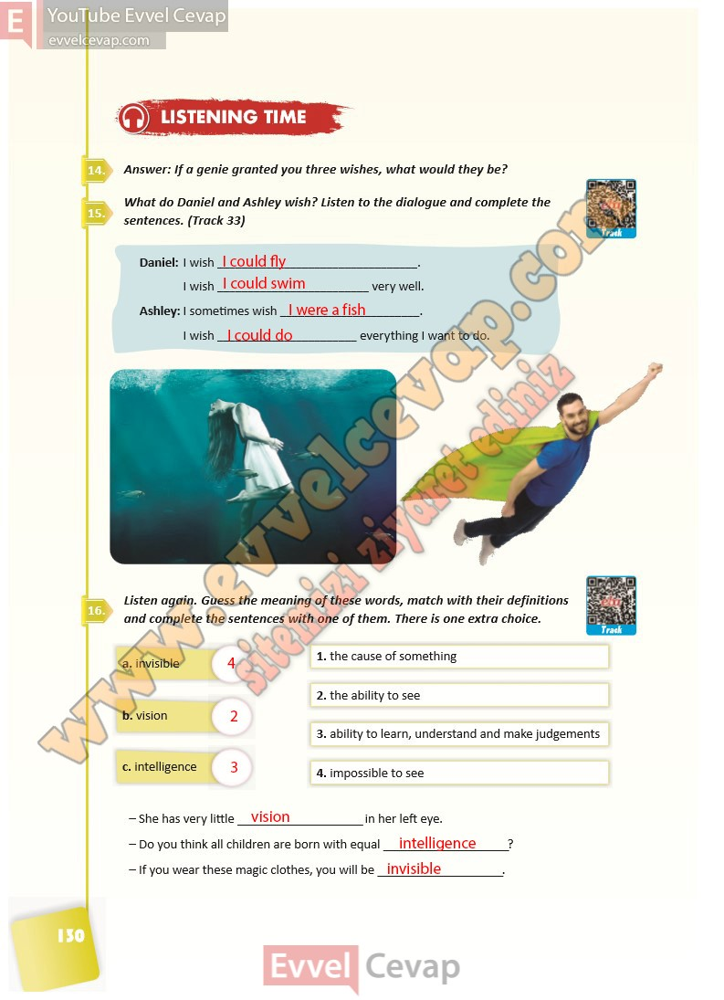

# 10. Sınıf İngilizce Ders Kitabı Cevapları Pasifik Yayınları Sayfa 130

---

**Soru: Answer: If a genie granted you three wishes, what would the y be?**

**Soru: What do Daniel and Ashley wish? Listen to the dialogue and complete the sentences. (Track 33)**

**Soru: Listen again. Guess the meaning of these words, mat ch with their definitions and complete the sentences with one of them. There is one e xtra choice.**

-   **Cevap**:

