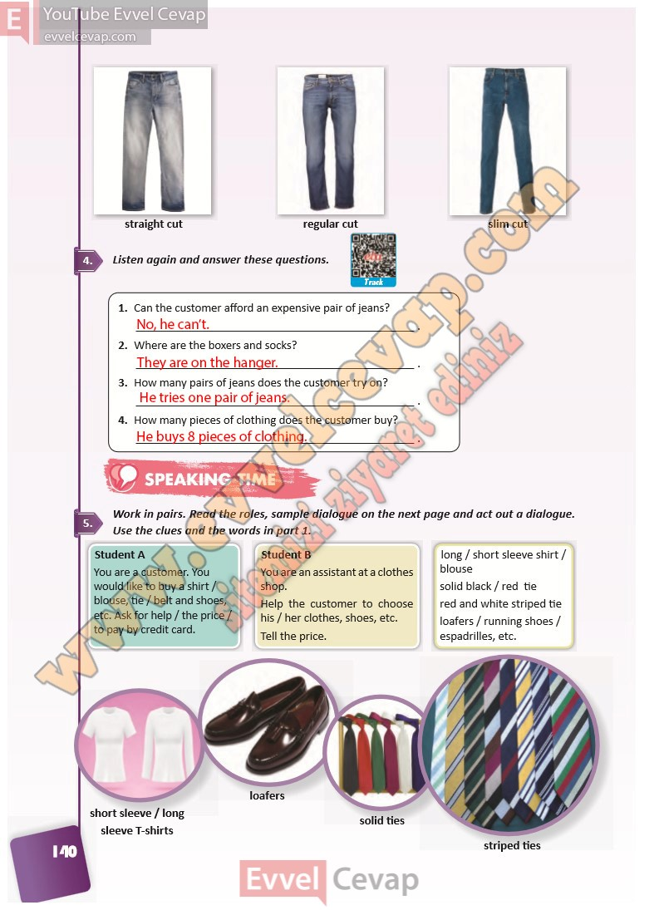

# 10. Sınıf İngilizce Ders Kitabı Cevapları Pasifik Yayınları Sayfa 140

---

**Soru: Listen again and answer these questions.**

**Soru: Can the customer afford an expensive pair of jeans?**

**Soru: Where are the boxers and socks?**

**Soru: How many pairs of jeans does the customer try on?**

**Soru: How many pieces of clothing does the customer buy?**

**Soru: Work in pairs. Read the roles, sample dialogue on the next page and act out a dialogue. Use the clues and the words in part 1.**

-   **Cevap**:

