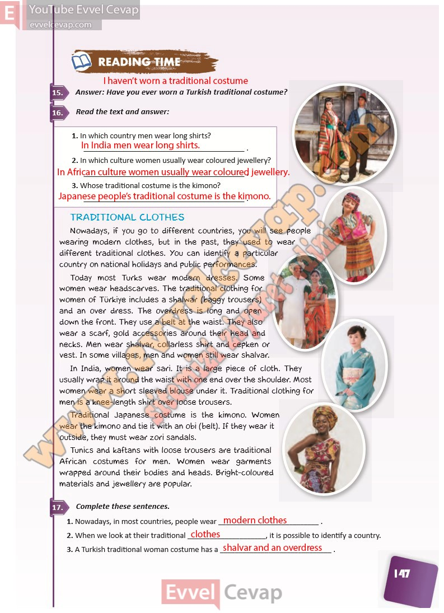

# 10. Sınıf İngilizce Ders Kitabı Cevapları Pasifik Yayınları Sayfa 147

---

**Soru: Answer: Have you ever worn a Turkish traditional costume?**

**Soru: Read the text and answer:**

**Soru: In which country men wear long shirts?**

**Soru: In which culture women usually wear coloured jewellery?**

**Soru: Whose traditional costume is the kimono?**

**Soru: Complete these sentences.**

-   **Cevap**:

