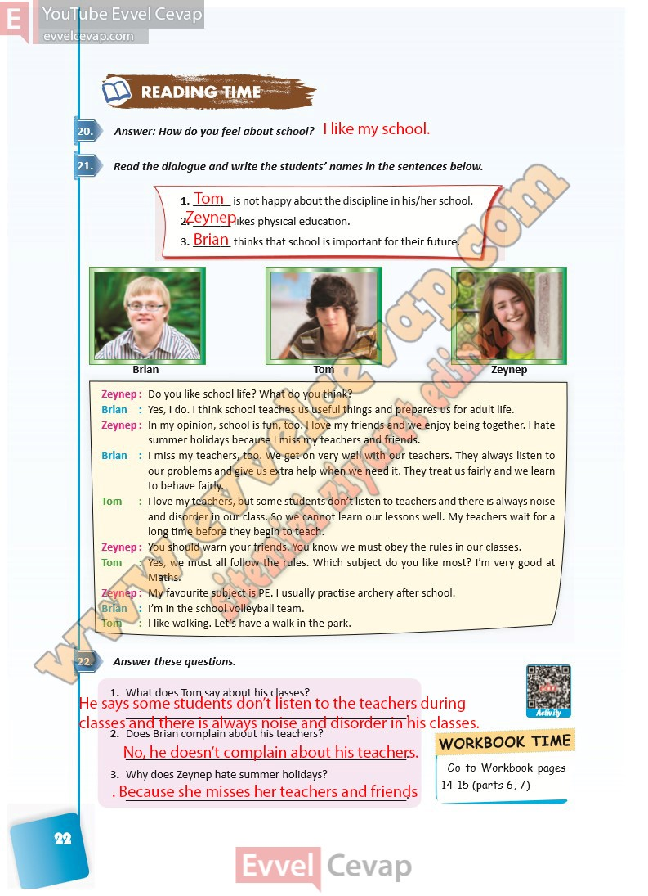

# 10. Sınıf İngilizce Ders Kitabı Cevapları Pasifik Yayınları Sayfa 22

---

**Soru: Answer: How do you feel about school?**

**Soru: Read the dialogue and write the students’ names in the sentences below.**

**Soru: Answer these questions.**

**Soru: What does Tom say about his classes?**

**Soru: Does Brian complain about his teachers?**

**Soru: Why does Zeynep hate summer holidays?**

-   **Cevap**:

