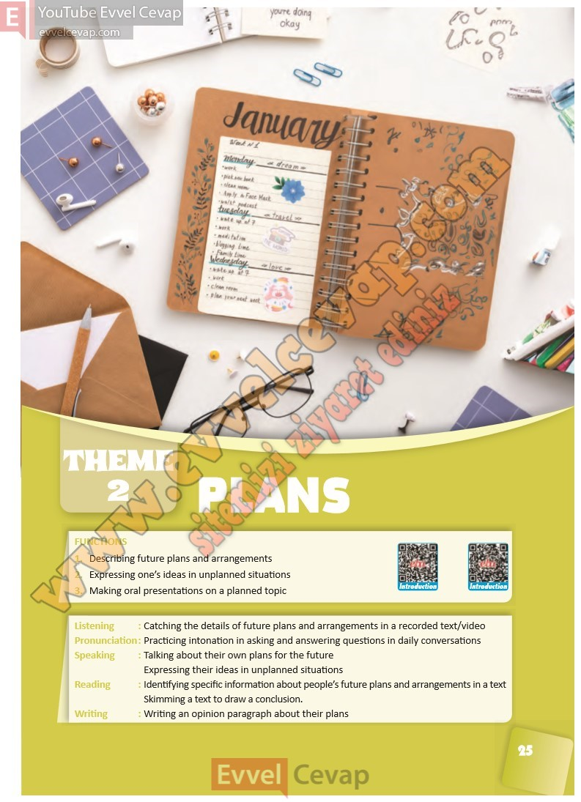

# 10. Sınıf İngilizce Ders Kitabı Cevapları Pasifik Yayınları Sayfa 25

---

1. Describing future plans and arrangements

 2. Expressing one’s ideas in unplanned situations

 3. Making oral presentations on a planned topic

-   **Cevap**:

