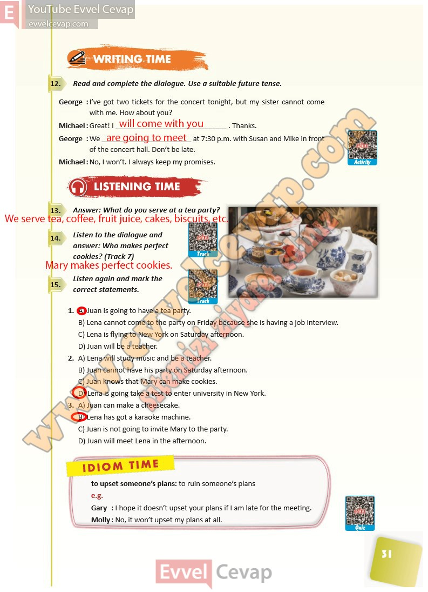

# 10. Sınıf İngilizce Ders Kitabı Cevapları Pasifik Yayınları Sayfa 31

---

**Soru: Read and complete the dialogue. Use a suitable future tense.**

**Soru: Answer: What do you serve at a tea party?**

**Soru: Listen to the dialogue and answer: Who makes perfect cookies? (Track 7)**

**Soru: Listen again and mark the correct statements.**

-   **Cevap**:

