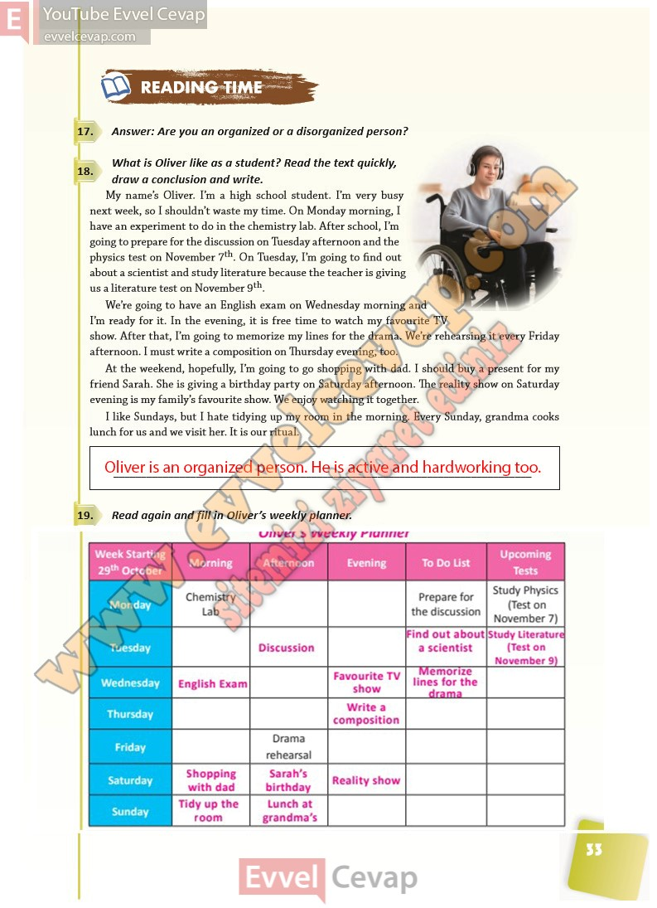

# 10. Sınıf İngilizce Ders Kitabı Cevapları Pasifik Yayınları Sayfa 33

---

**Soru: Answer: Are you an organized or a disorganized person?**

**Soru: What is Oliver like as a student? Read the text quickly, draw a conclusion and write.**

**Soru: Read again and fill in Oliver ’s weekly planner.**

-   **Cevap**:

