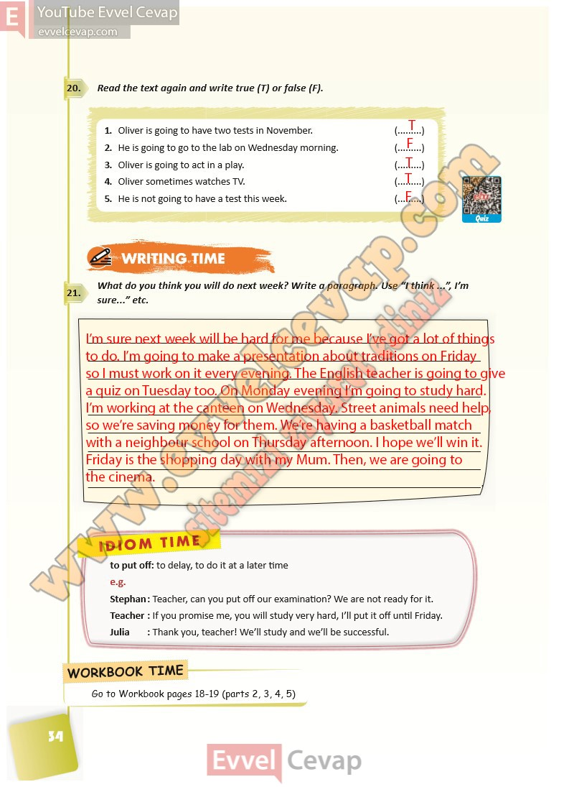

# 10. Sınıf İngilizce Ders Kitabı Cevapları Pasifik Yayınları Sayfa 34

---

**Soru: Read the text again and write true (T) or false (F).**

1. Oliver is going to have two tests in November.

 2. He is going to go to the lab on Wednesday morning.

 3. Oliver is going to act in a play.

 4. Oliver sometimes watches TV.

 5. He is not going to have a test this week.

**Soru: What do you think you will do ne xt week? Write a paragraph. Use “I think …”, I’m sure…” etc.**

-   **Cevap**:

