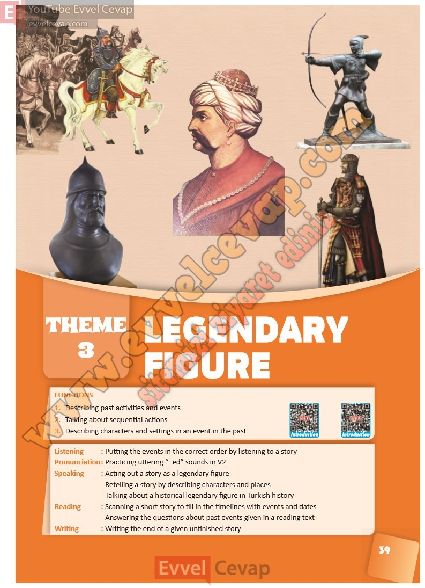

# 10. Sınıf İngilizce Ders Kitabı Cevapları Pasifik Yayınları Sayfa 39

---

1. Describing past activities and events

 2. Talking about sequential actions

 3. Describing characters and settings in an event in the past

-   **Cevap**:

