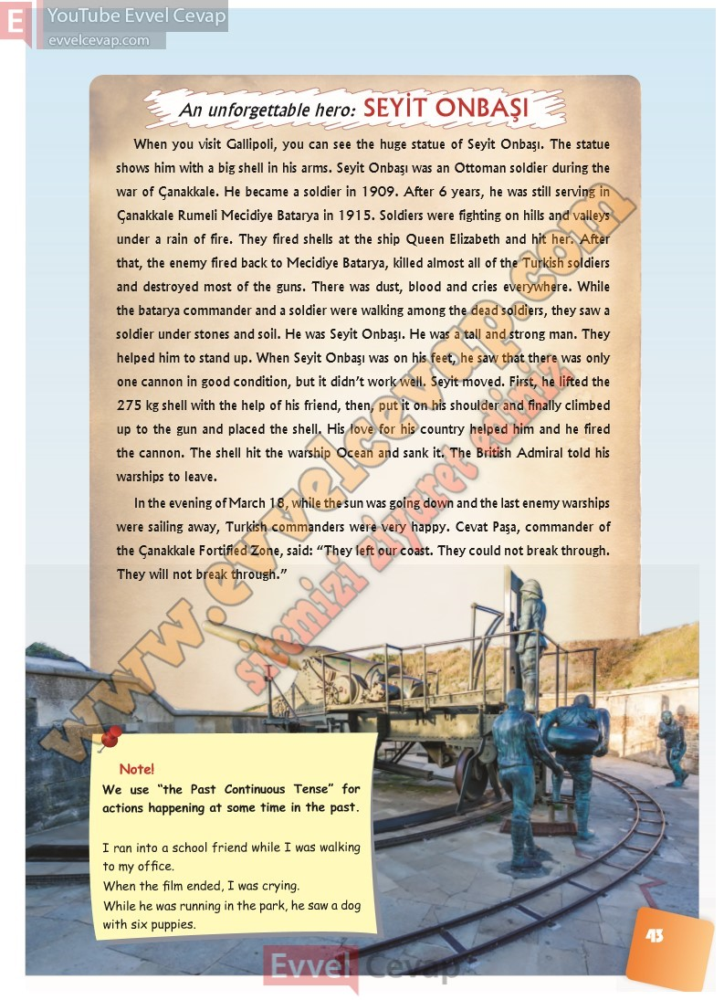

# 10. Sınıf İngilizce Ders Kitabı Cevapları Pasifik Yayınları Sayfa 43

---

When you visit Gallipoli, you can see the huge statue of Seyit Onbaşı. The statue shows him with a big shell in his arms. Seyit Onbaşı was an Ottoman soldier during the war of Çanakkale. He became a soldier in 1909. After 6 years, he was still serving in Çanakkale Rumeli Mecidiye Batarya in 1915. Soldiers were fighting on hills and valleys under a rain of fire. They fired shells at the ship Queen Elizabeth and hit her. After that, the enemy fired back to Mecidiye Batarya, killed almost all of the Turkish soldiers and destroyed most of the guns. There was dust, blood and cries everywhere. While the batarya commander and a soldier were walking among the dead soldiers, they saw a soldier under stones and soil. He was Seyit Onbaşı. He was a tall and strong man. They helped him to stand up. When Seyit Onbaşı was on his feet, he saw that there was only one cannon in good condition, but it didn’t work well. Seyit moved. First, he lifted the 275 kg shell with the help of his friend, then, put it on his shoulder and finally climbed up to the gun and placed the shell. His love for his country helped him and he fired the cannon. The shell hit the warship Ocean and sank it. The British Admiral told his warships to leave.

 In the evening of March 18, while the sun was going down and the last enemy warships were sailing away, Turkish commanders were very happy. Cevat Paşa, commander of

 the Çanakkale Fortified Zone, said: “They left our coast. They could not break through.

 They will not break through

We use “the Past Continuous Tense” for actions happening at some time in the past.

 I ran into a school friend while I was walking to my office.

 When the film ended, I was crying.

 While he was running in the park, he saw a dog

 with six puppies

-   **Cevap**:

