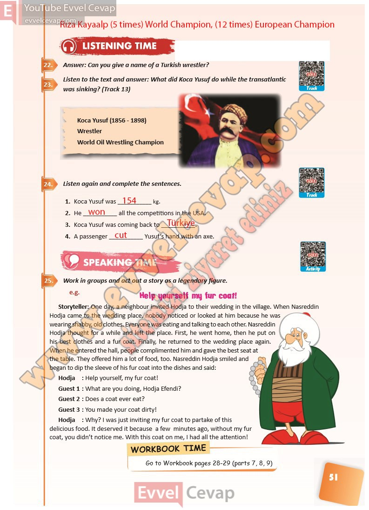

# 10. Sınıf İngilizce Ders Kitabı Cevapları Pasifik Yayınları Sayfa 51

---

**Soru: Answer: Can you give a name of a Turkish wrestler?**

**Soru: Listen to the text and answer: What did Koca Yusuf do while the transatlantic was sinking? (Track 13)**

**Soru: Listen again and complete the sentences.**

**Soru: Work in groups and act out a story as a legendary figure.**

-   **Cevap**:

