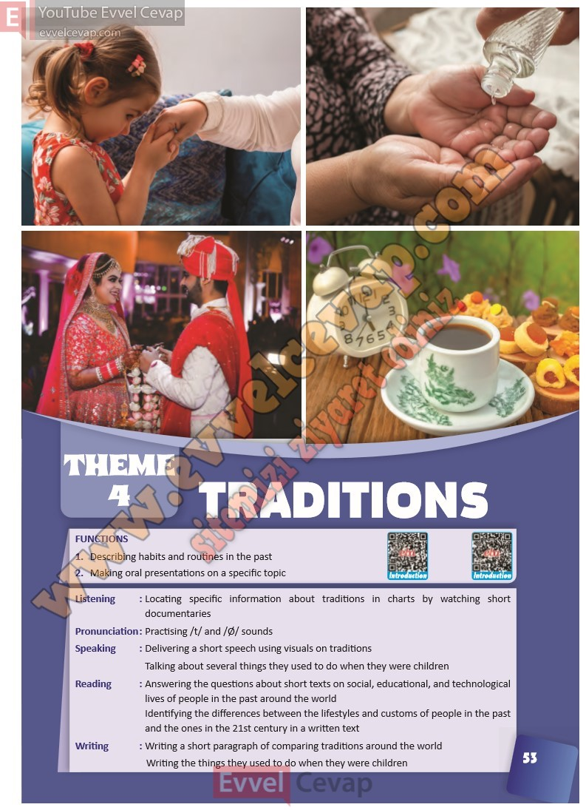

# 10. Sınıf İngilizce Ders Kitabı Cevapları Pasifik Yayınları Sayfa 53

---

1. Describing habits and routines in the past

 2. Making oral presentations on a specific topic

 Listening : Locating specific information about traditions in charts by watching short

 documentaries

 Pronunciation : Practising /t/ and /Ø/ sounds

 Speaking : Delivering a short speech using visuals on traditions

 Talking about several things they used to do when they were children

 Reading : Answering the questions about short texts on social, educational, and technological

 lives of people in the past around the world

 Identifying the differences between the lifestyles and customs of people in the past

 and the ones in the 21st century in a written text

 Writing : Writing a short paragraph of comparing traditions around the world

 Writing the things they used to do when they were children

-   **Cevap**:

