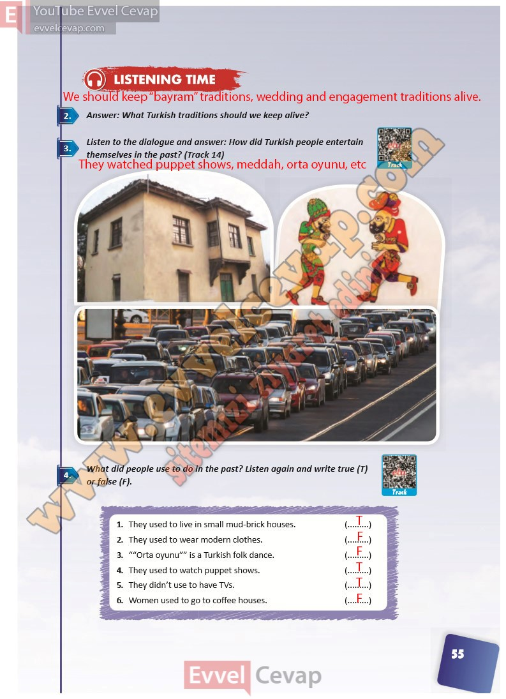

# 10. Sınıf İngilizce Ders Kitabı Cevapları Pasifik Yayınları Sayfa 55

---

**Soru: Answer: What Turkish traditions should we keep alive?**

**Soru: Listen to the dialogue and answer: How did Turkish people entertain themselves in the past? (Track 14)**

**Soru: What did people use to do in the past? Listen again and write true (T)****or false (F).**

-   **Cevap**:

