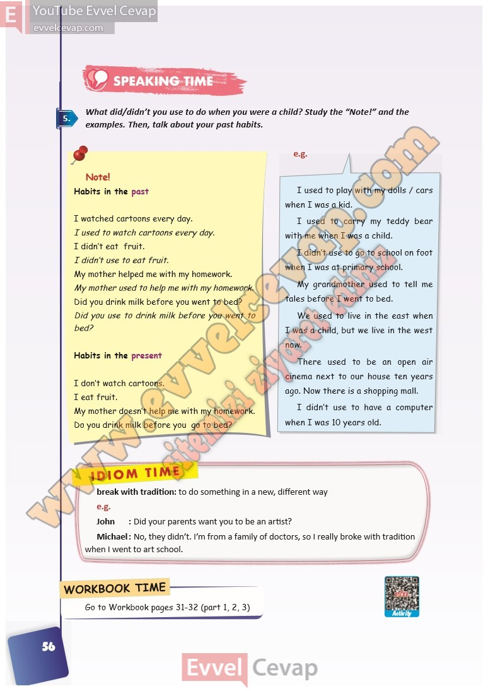

# 10. Sınıf İngilizce Ders Kitabı Cevapları Pasifik Yayınları Sayfa 56

---

**Soru: What did/didn’t you use to do when you were a chi ld? Study the “Note!” and the examples. Then, talk about your past habits.**

-   **Cevap**:

