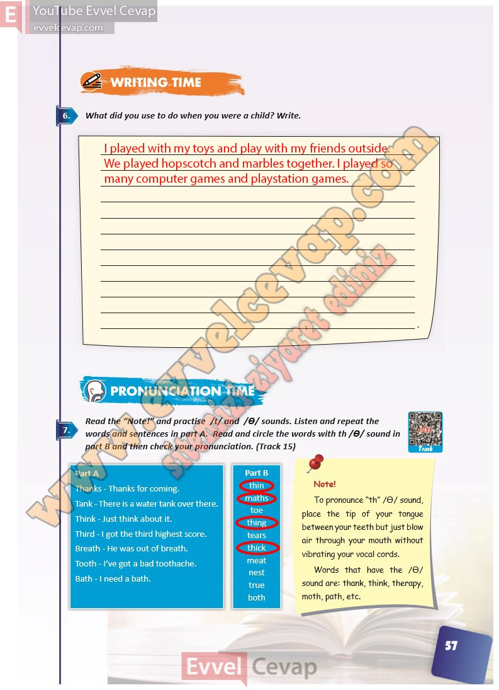

# 10. Sınıf İngilizce Ders Kitabı Cevapları Pasifik Yayınları Sayfa 57

---

**Soru: What did you use to do when you were a child? Write.**

**Soru: Read the “Note!” and practise /t/ and / Ɵ/ sounds. Listen and repeat the words and sentences in part A. Read and circle the words with th / Ɵ/ sound in part B and then check your pronunciation. ( Track 15)**

-   **Cevap**:

