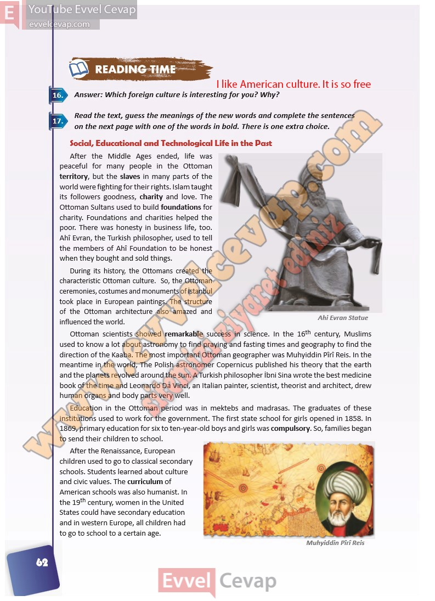

# 10. Sınıf İngilizce Ders Kitabı Cevapları Pasifik Yayınları Sayfa 62

---

**Soru: Answer: Which foreign culture is interesting for you? Why?**

**Soru: Read the text, guess the meanings of the ne w words and complete the sentences on the next page with one of the words in bold. There is one e xtra choice.**

-   **Cevap**:

