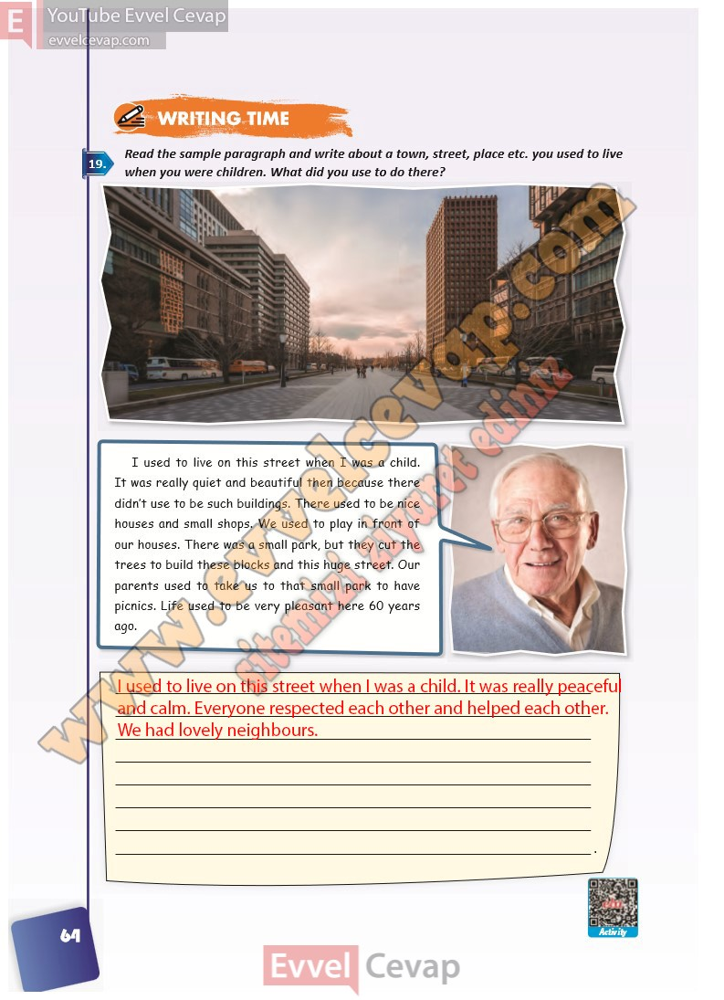

# 10. Sınıf İngilizce Ders Kitabı Cevapları Pasifik Yayınları Sayfa 64

---

**Soru: Read the sample paragraph and writ e about a town, street, place etc. you used to live when you were children. What did you use to do there?**

-   **Cevap**:

