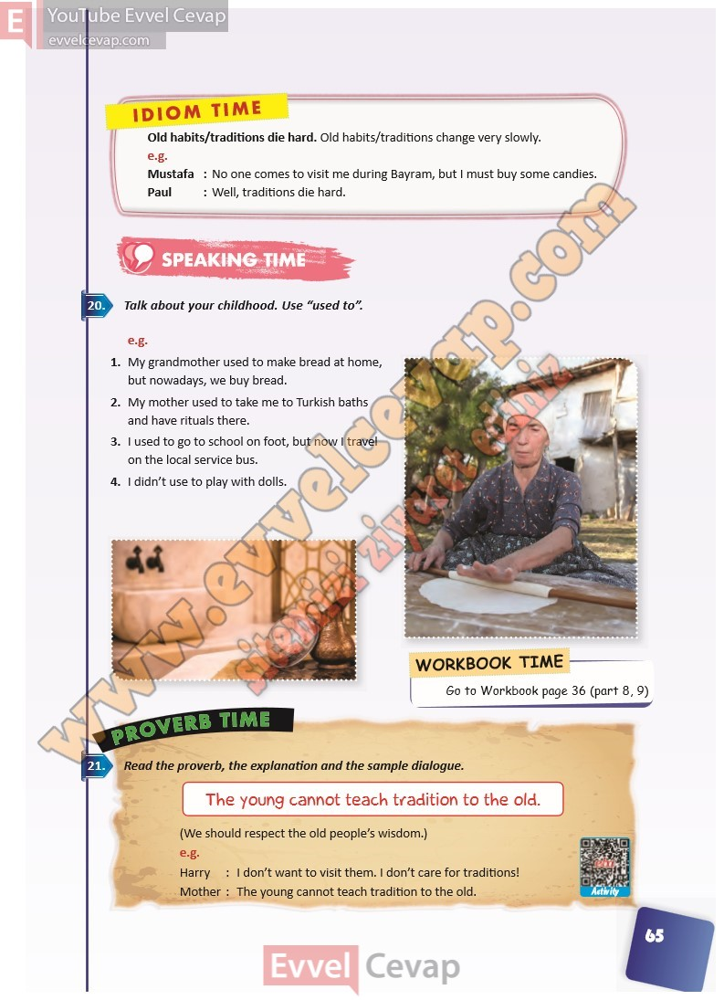

# 10. Sınıf İngilizce Ders Kitabı Cevapları Pasifik Yayınları Sayfa 65

---

Old habits/traditions die hard. Old habits/traditions change very slowly.

 e.g.

 Mustafa : No one comes to visit me during Bayram, but I must buy some candies.

 Paul : Well, traditions die hard.

**Soru: Talk about your childhood. Use “used to”.**

1. My grandmother used to make bread at home, but nowadays, we buy bread.

 2. My mother used to take me to Turkish baths and have rituals there.

 3. I used to go to school on foot, but now I travel on the local service bus.

 4. I didn’t use to play with dolls.

**Soru: Read the proverb, the explanation and the sample dialogue.**

-   **Cevap**:

