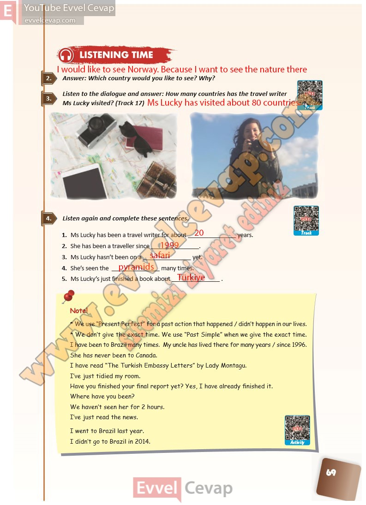

# 10. Sınıf İngilizce Ders Kitabı Cevapları Pasifik Yayınları Sayfa 69

---

**Soru: Answer: Which country would you like to see? Why?**

**Soru: Listen to the dialogue and answer: How many countries has the travel writer Ms Lucky visited? (Track 17)**

**Soru: Listen again and complete these sentences.**

-   **Cevap**:

