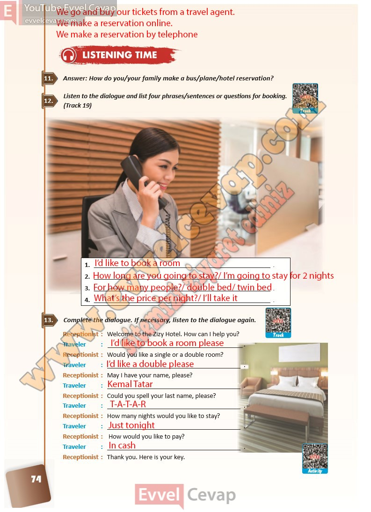

# 10. Sınıf İngilizce Ders Kitabı Cevapları Pasifik Yayınları Sayfa 74

---

**Soru: Answer: How do you/your family make a bus/plane/hotel reservation?**

**Soru: Listen to the dialogue and list four phrases/sentences or questions for booking. (Track 19)**

**Soru: Complete the dialogue. If necessary, listen to the dialogue again.**

-   **Cevap**:

