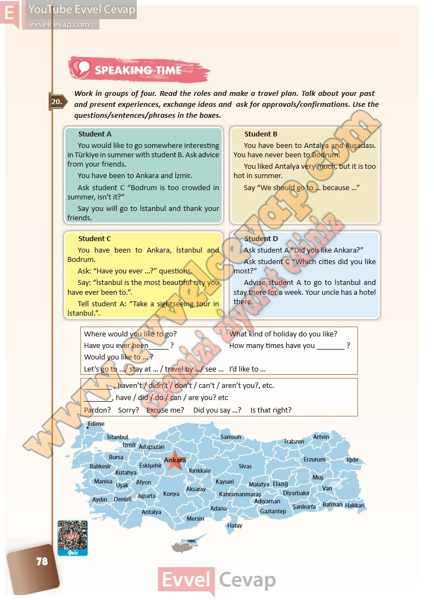

# 10. Sınıf İngilizce Ders Kitabı Cevapları Pasifik Yayınları Sayfa 78

---

**Soru: Work in groups of four. Read the roles and make a travel plan. Talk about your past and present experiences, exchange ideas and ask for approvals/confirmations. Use the questions/sentences/phrases in the boxes.**

-   **Cevap**:

