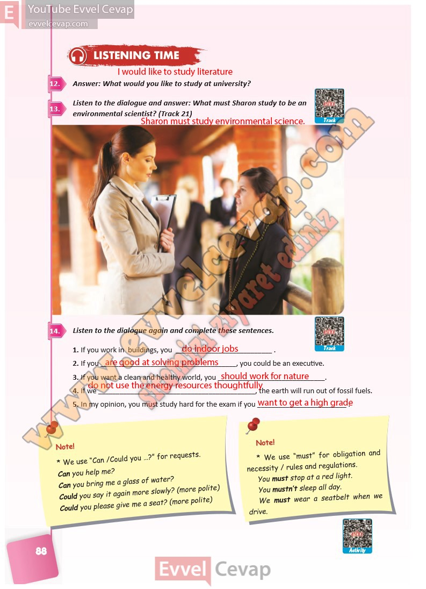

# 10. Sınıf İngilizce Ders Kitabı Cevapları Pasifik Yayınları Sayfa 88

---

**Soru: Answer: What would you like to study at university?**

**Soru: Listen to the dialogue and answer: What must Sharon study to be an environmental scientist? (Track 21)**

**Soru: Listen to the dialogue again and complete these sentences.**

-   **Cevap**:

