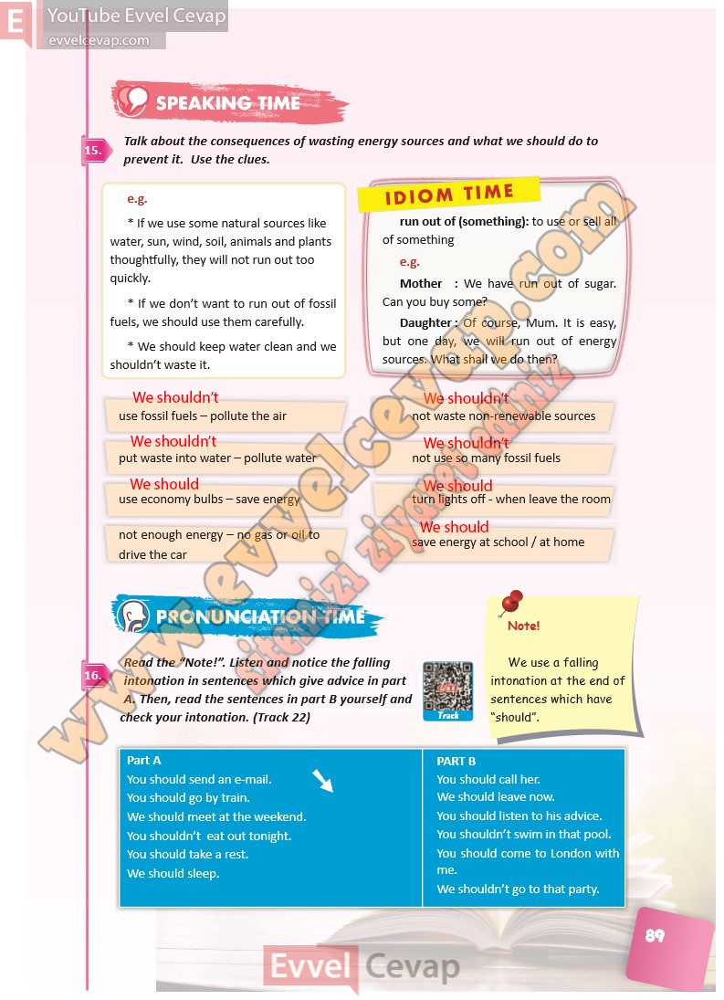

# 10. Sınıf İngilizce Ders Kitabı Cevapları Pasifik Yayınları Sayfa 89

---

**Soru: Talk about the consequences of wasting energy sources and what we should do to prevent it. Use the clues.**

**Soru: Read the “Note!”. Listen and notice the falling intonation in sentences which give advice in part A. Then, read the sentences in part B yourself and check your intonation. (Track 22)**

-   **Cevap**:

