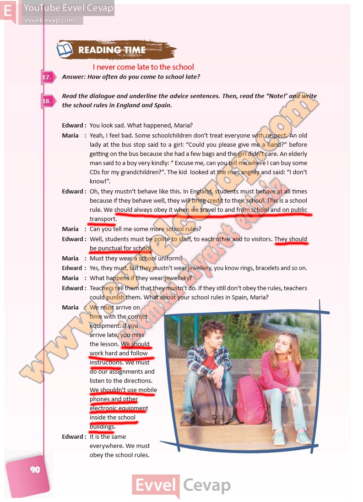

# 10. Sınıf İngilizce Ders Kitabı Cevapları Pasifik Yayınları Sayfa 90

---

**Soru: Answer: How often do you come to school late?**

**Soru: Read the dialogue and underline the advic e sentences. Then, read the “Note!’ and write the school rules in England and Spain.**

-   **Cevap**:

