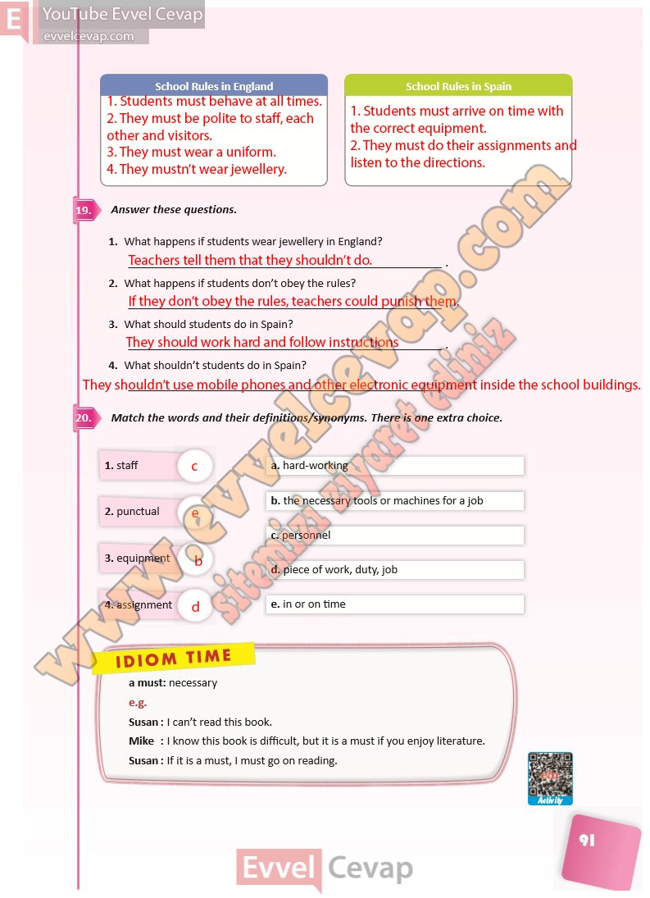

# 10. Sınıf İngilizce Ders Kitabı Cevapları Pasifik Yayınları Sayfa 91

---

**Soru: Answer these questions.**

**Soru: What happens if students wear jewellery in England?**

**Soru: What happens if students don’t obey the rules?**

**Soru: What should students do in Spain?**

**Soru: What shouldn’t students do in Spain?**

**Soru: Match the words and their definitions/synonyms. There is one extra choice.**

-   **Cevap**:

