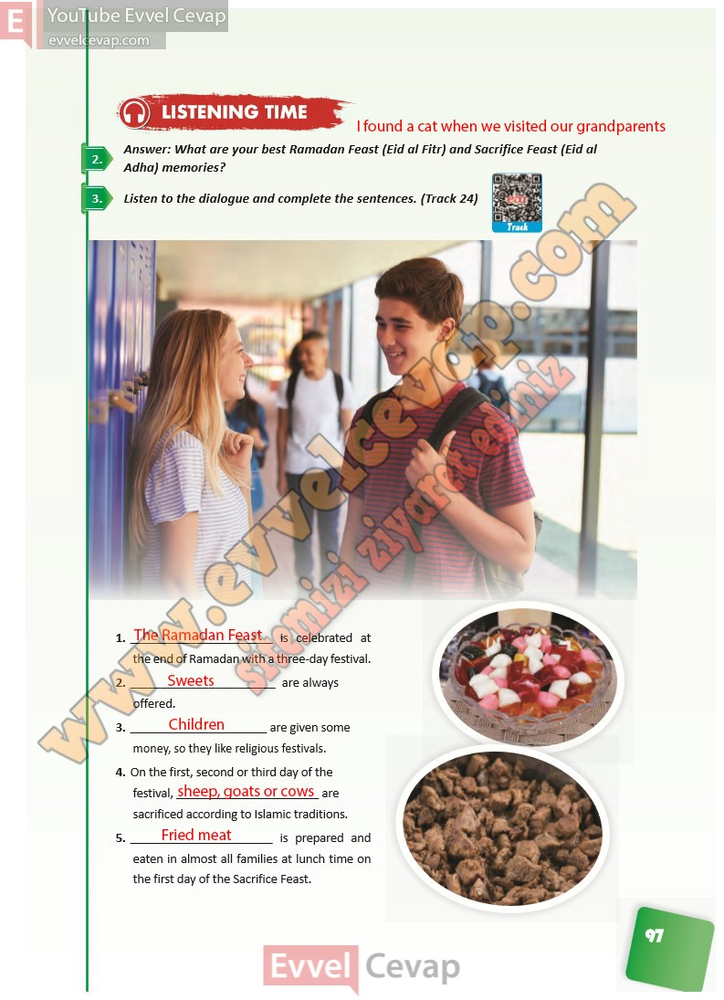

# 10. Sınıf İngilizce Ders Kitabı Cevapları Pasifik Yayınları Sayfa 97

---

**Soru: Answer: What are your best Ramadan Feast (Eid al Fitr) and Sacrifice Feast (Eid al Adha) memories?**

**Soru: Listen to the dialogue and complete the sentences. (Track 24)**

-   **Cevap**:

