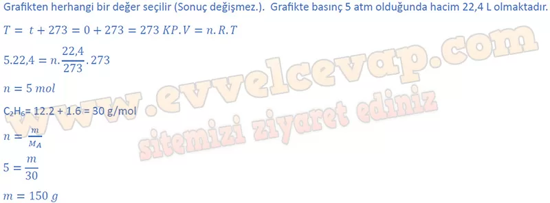
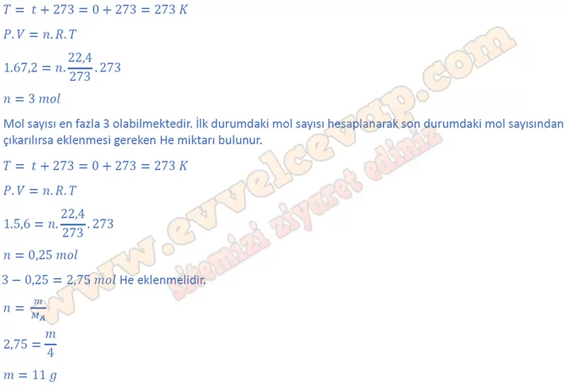
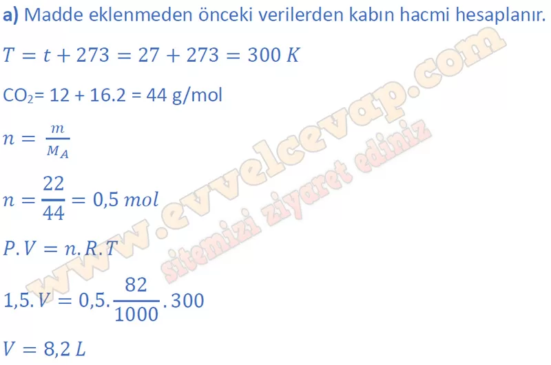
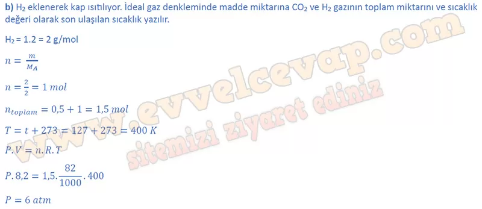

# 10. Sınıf Kimya Ders Kitabı Meb Yayınları Cevapları Sayfa 103

---

**Çalışma Yaprağı**

**Soru: Aşağıdaki soruları cevaplayınız.**

**Soru: 1) 0 °C sıcaklıkta ideal pistonlu bir kapta bulunan C2H6 gazına ait basınç-hacim grafiği yan tarafta verilmiştir. Buna göre kapta kaç g C 2 H 6 gazı bulunmaktadır? (C: 12 g/mol, H: 1 g/mol)**

-   **Cevap**:

**Soru: 2) Yandaki elastik balonun içerisinde 1 atm basınçta bir miktar He gazı bulunmaktadır. Elastik balonun hacmi en fazla 67,2 L’ye kadar dayanabilmektedir. Buna göre sabit sıcaklıkta kaba en fazla kaç g daha He gazı eklenebilir? (He: 4 g/mol)**

-   **Cevap**:

**Soru: 3) Yandaki cam kapta bulunan C02 gazının basıncı 1,5 atm’dir. K musluğu açılarak kaba 2 g H2 gazı ilave ediliyor ve sıcaklık 127 °C sıcaklığa çıkarılıyor. Buna göre;**

**Soru: a) Cam kabın hacmi kaç L’dir?**

-   **Cevap**:

**Soru: b) Son durumda kaptaki basınç kaç atm’dir?**

-   **Cevap**:

