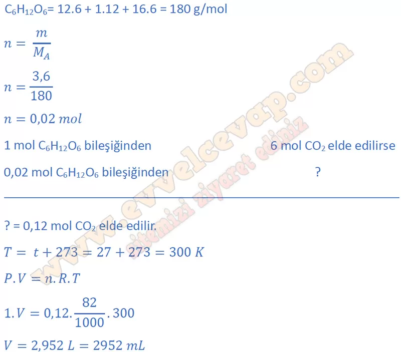
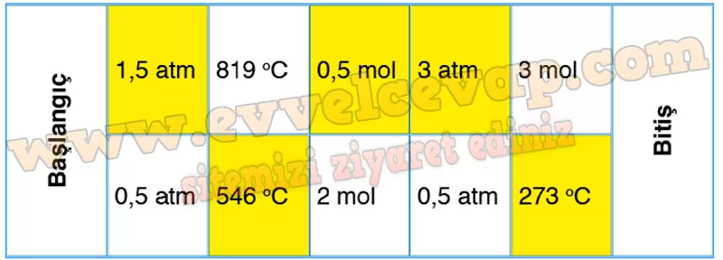
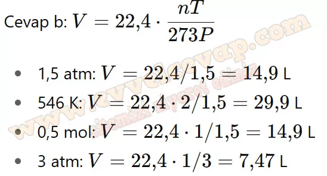
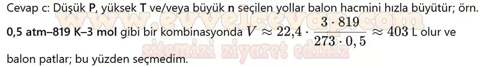

# 10. Sınıf Kimya Ders Kitabı Meb Yayınları Cevapları Sayfa 105

---

**Kontrol Noktası**

**Soru: 1) Glikozun yanma tepkimesi aşağıdaki gibidir: C 6 H 12 O 6 + 602(g) — 6CO 2(g) + 6H 2 O(s) Tepkimede 3,6 g glikoz kullanıldığında 27 °C sıcaklıkta ve 1 atm basınçta üretilen C02 gazının hacmi kaç mL’dir? (H: 1 g/mol, C: 12 g/mol, O: 16 g/mol)**

-   **Cevap**:

**Soru: 2) Bir öğrenci ideal gaz denkleminin uygulamasını yapmak için bir bilgisayar oyunu tasarlıyor. Oyun hakkındaki bilgiler şunlardır:**

➡️Oyun 2×5 ebadındaki bir platform üzerinde oynanmaktadır.

 ➡️Platformdaki her bir bölmede belli değerlerde basınç, sıcaklık veya mol sayıları verilmiştir.

 ➡️Balon hangi bölmeye yönlendirilirse o bölmenin sahip olduğu değeri almaktadır (Örneğin balon 0,5 atm bölmesine yönlendirilirse bir sonraki basınç değişimine kadar basınç değeri 0,5 atm olarak kalmaktadır.).

 ➡️Her seferinde ileri veya çapraz sadece bir kare ilerlenebilir.

 ➡️Oyunun amacı 0 °C sıcaklıkta, 1 atm basınçta, 1 mol gaz içeren elastik balonu patlatmadan platform üzerinden geçerek çıkışa ulaşmaktır (Balon, hacmi 56 L olduğu anda patlamaktadır.).

**Soru: a) Balonun patlamadan çıkışa ulaşabilmesi için nasıl bir yol izlenmelidir? Platform üzerinde uygun kareleri işaretleyerek gösteriniz,**

-   **Cevap**:

**Soru: b) Seçtiğiniz yolun her bir adımı için hangi hesaplamaları yaptığınızı yazınız.**

-   **Cevap**:

**Soru: c) Diğer yolları seçmeme nedeninizi hesaplamalar üzerinden gerekçelendirerek açıklayınız.**

-   **Cevap**:

