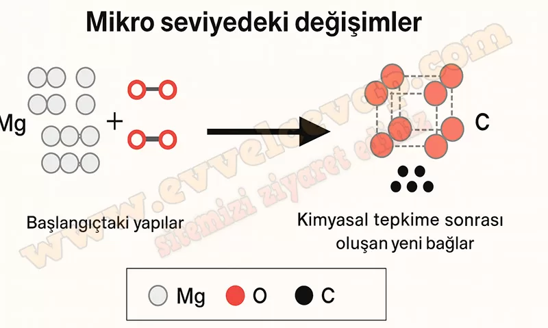

# 10. Sınıf Kimya Ders Kitabı Meb Yayınları Cevapları Sayfa 118

---

**Soru: 5) Metinde geçen tepkimelerden yola çıkarak aşağıdaki deneyler yapılmış ve gözlem sonuçları kaydedilmiştir. Tabloda verilen deneylerde kimyasal değişimlerin gözlemlenebilir göstergelerini yazınız.**

-   **Cevap**:

**Soru: 6) Magnezyum metalinin C02 bileşiği ile tepkimesine ait tepkime denklemi şu şekildedir: Bu kimyasal tepkimeyi alt mikro seviyedeki değişimleri de göz önünde bulundurarak tepkimeye giren atomlar arasındaki bağ değişimlerini gösteren bir şekil çiziniz. Açıklamanızda aşağıdaki noktaları dikkate alınız:**

**Soru: Magnezyum ve karbon dioksidin başlangıçtaki yapıları nasıldır?**

-   **Cevap**: Magnezyum başlangıçta metalik yapıda serbest atomlar hâlindedir, karbon dioksit ise C=O çift bağları içeren doğrusal moleküllerden oluşur.

**Soru: Kimyasal tepkime sırasında hangi bağlar kırılır ve hangi yeni bağlar oluşur?**

-   **Cevap**: Tepkime sırasında CO₂’deki C=O bağları kırılır; yeni Mg–O bağları oluşarak MgO meydana gelir, ayrıca serbest karbon (C) açığa çıkar.

**Soru: Gözlemlenebilir değişimler (renk, ürün oluşumu vb.) nelerdir?**

-   **Cevap**: epkime sonucunda beyaz renkli MgO katısı ve siyah renkli karbon (kömür benzeri) oluşur; parlak magnezyum metali tükenir.

**Soru: 7) Magnezyum yangınlarında karbon dioksit veya su kullanmanın tehlikeleri, bu maddelerle gerçekleşen kimyasal tepkimelere dayanır. Bu tepkimeler yangın söndürme yöntemlerini nasıl etkiler? Verilen metinden yola çıkarak açıklayınız.**

-   **Cevap**: Magnezyum su ve karbon dioksitle tepkimeye gireceği için magnezyum yangınlarında kullanılmamalıdır.