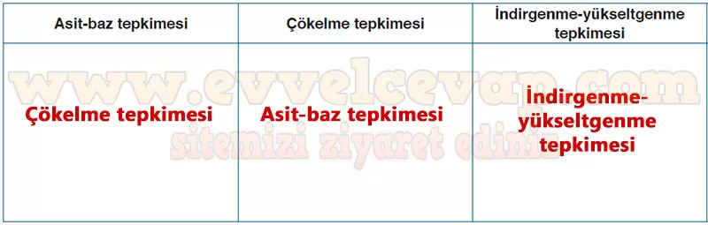

# 10. Sınıf Kimya Ders Kitabı Meb Yayınları Cevapları Sayfa 121

---

**Soru: 12) Metinde geçen tepkimelerin gözlemlenebilir göstergeleri aşağıdakilerden hangisinde doğru şekilde sıralanmıştır?**

A) Katı oluşumu Sıvı oluşumu Gaz çıkışı

 B) pH değişimi Katı oluşumu Katı oluşumu

 C) Katı oluşumu pH değişimi Gaz çıkışı

 D) pH değişimi Sıvı oluşumu pH değişimi

 E) Gaz çıkışı pH değişimi Katı oluşumu

-   **Cevap**: **C**

**Soru: 13) Metinde geçen tepkimelerin sembolik gösterimlerinden ve gözlemlenebilir göstergelerinden yola çıkarak tepkimelerin türlerini belirleyiniz. Belirlediğiniz tepkime türlerini aşağıdaki tabloya yazınız.**

-   **Cevap**:

**Soru: 14) Metinde geçen tepkimelerin oluşum süreçlerini alt mikro seviyede tanecik modeli ile çizerek açıklayınız.**

-   **Cevap**:

**I. tepkime — Mg²⁺(suda) + 2 OH⁻(suda) → Mg(OH)₂(k) (çökelme)**

-   _Alt mikro:_ Hidratlı Mg²⁺ iyonu ile iki OH⁻ iyonu elektrostatik çekimle yakınlaşır, iyonik kafes oluşturur; su kabukları ayrılır.

-   _Açıklama:_ Az çözünür **beyaz Mg(OH)₂** katısı çöker (çökelme tepkimesi).

**II. tepkime — Mg(OH)₂(k) + 2 HCl(suda) → MgCl₂(suda) + 2 H₂O(s) (asit-baz/nötralleşme)**

-   _Alt mikro:_ HCl çözeltisindeki H⁺(H₃O⁺) iyonları, katının yüzeyinden gelen OH⁻ iyonlarıyla birleşip **H₂O** oluşturur; geride kalan Mg²⁺ ile Cl⁻ iyonları çözeltide **MgCl₂** olarak bulunur.

-   _Açıklama:_ pH nötrleşir, Mg(OH)₂ çözünür, su oluşur.

**III. tepkime — MgCl₂(s) → Mg(k) + Cl₂(g) (elektroliz, redoks)**

-   _Alt mikro:_ Erimiş MgCl₂’de **katotta** Mg²⁺ + 2e⁻ → Mg(s) indirgenir; **anotta** 2Cl⁻ → Cl₂(g) + 2e⁻ yükseltgenir.

-   _Açıklama:_ Metalik **Mg** ve **Cl₂ gazı** elde edilir; elektron alış-verişi gerçekleşir.