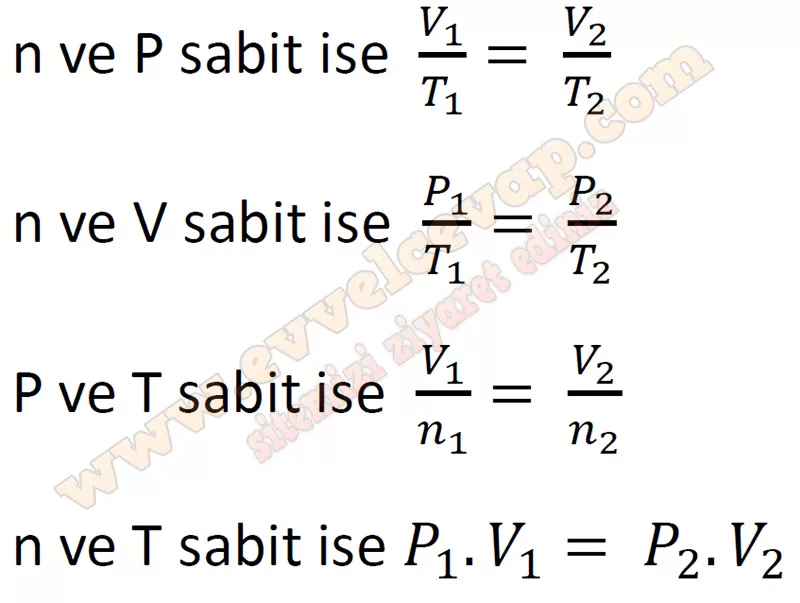

# 10. Sınıf Kimya Ders Kitabı Meb Yayınları Cevapları Sayfa 130

---

**Soru: 36) Her etapta değişen ve sabit tutulan iki özellik için bir grafik çizilmiştir. Verilen grafiklerden yararlanarak matematiksel bir eşitlik türetiniz.**

-   **Cevap**:

