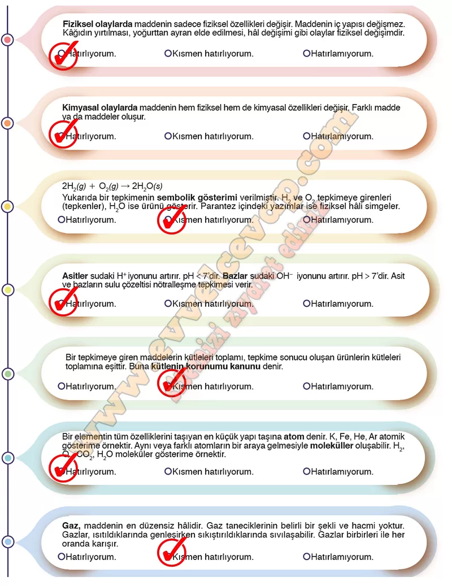

# 10. Sınıf Kimya Ders Kitabı Meb Yayınları Cevapları Sayfa 20

---

**Hazır mısınız?**

**Soru: Aşağıda “Etkileşim” teması ile ilgili temel kavramlar verilmiştir. Verilen bilgiler doğrultusunda hatırlama düzeyinize göre kendinize uygun olan kutucuğu işaretleyiniz. Eksiklerinizin olduğunu düşündüğünüz konular için tema öncesinde gerekli tekrarları yapabilirsiniz.**

-   **Cevap**:

