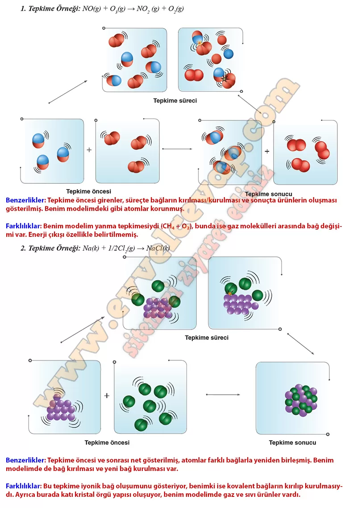

# 10. Sınıf Kimya Ders Kitabı Meb Yayınları Cevapları Sayfa 29

---

**Soru: 3) Aşağıda bazı tepkimelerin alt mikro seviyede süreç aşamalı gösterimleri verilmiştir. Tepkime modellerini inceleyerek kendi modelinizle arasındaki benzerlik ve farklılıklar açıklayınız.**

-   **Cevap**:

