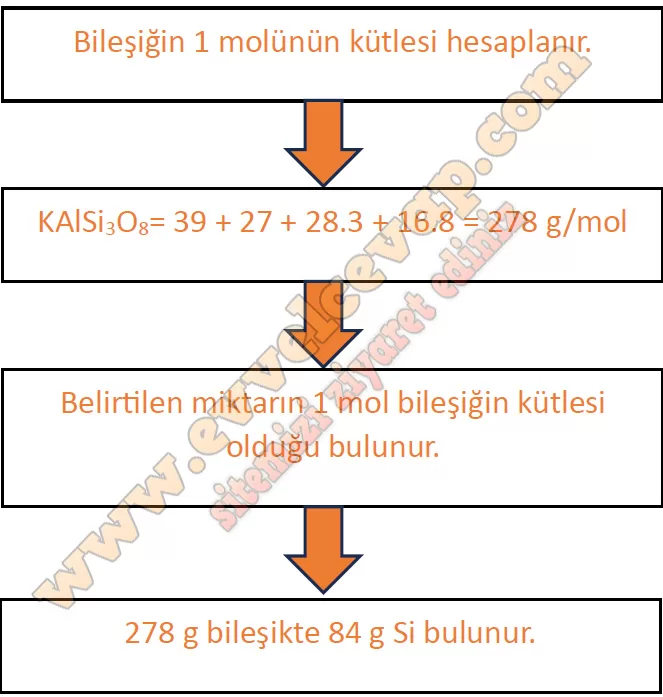
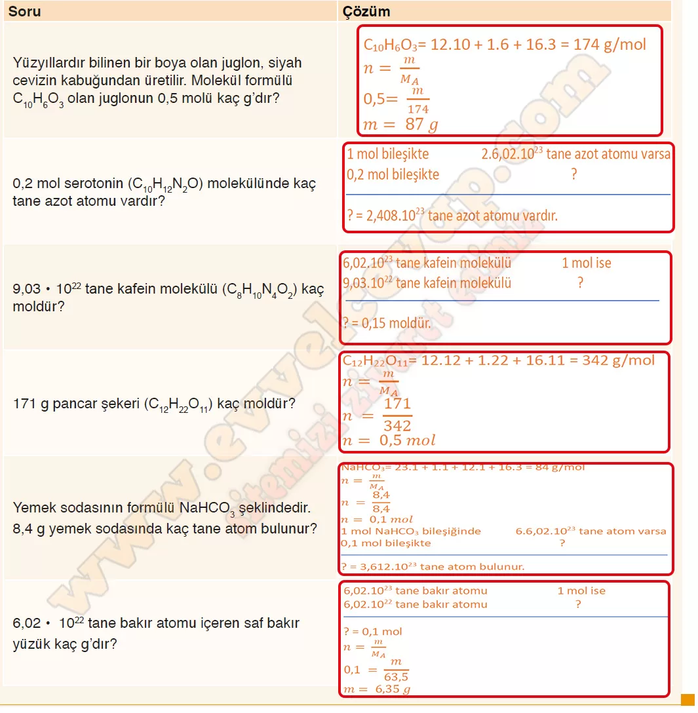

# 10. Sınıf Kimya Ders Kitabı Meb Yayınları Cevapları Sayfa 60

---

**Soru: 4)**Mol-kütle, mol-tanecik ve kütle-tanecik-mol ilişkilerine ait geçiş aşağıdaki gibidir:

 • Bir maddenin gram cinsinden kütlesinin mol kütlesine oranı mol sayısını verir.

 • Bir maddenin içerdiği tanecik sayısının Avogadro sayısına oranı mol sayısını verir.

 • Bir maddenin gram cinsinden kütlesinin içerdiği tanecik sayısının mol kütlesinin içerdiği tanecik sayısına oranı mol sayısını verir.**Yukarıdaki bilgileri kullanarak maddenin ölçülebilir özelliklerine ilişkin aşağıdaki soruları cevaplayınız.**

**Soru: Yüzyıllardır bilinen bir boya olan juglon, siyah cevizin kabuğundan üretilir. Molekül formülü C 10 H 6 O 3 olan juglonun 0,5 molü kaç g’dır?**

**Soru: 0,2 mol serotonin (C 10 H 12 N 2 O) molekülünde kaç tane azot atomu vardır?**

**Soru: 9,03 • 1022 tane kafein molekülü (C 8 H 10 N 4 O 2) kaç moldür?**

**Soru: 171 g pancar şekeri (C 12 H 12 O 11) kaç moldür?**

**Soru: Yemek sodasının formülü NaHC0 3 şeklindedir. 8,4 g yemek sodasında kaç tane atom bulunur?**

**Soru: 6,02 • 10 22 tane bakır atomu içeren saf bakır yüzük kaç g’dır?**

-   **Cevap**:

