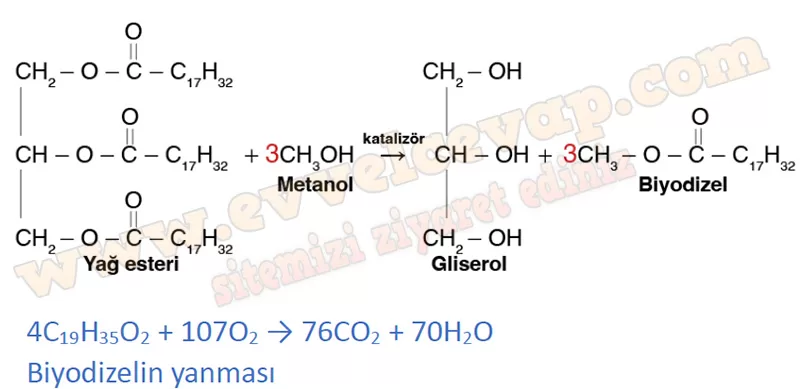

# 10. Sınıf Kimya Ders Kitabı Meb Yayınları Cevapları Sayfa 66

---

**Soru: 3) Canlılar, yaşamlarını devam ettirmek ve çoğalmak için enerjiye ihtiyaç duyarlar. Bu nedenle aldıkları besinleri solunum ile parçalayarak enerjiye dönüştürürler.**Oksijenli solunum sonucunda glikoz molekülü, C02 ve H20 molekülüne kadar parçalanırken oksijensiz ortamda tam parçalanma gerçekleşmez. Kullanılan enzimin türüne göre oksijensiz solunumda etil alkol veya laktik asit oluşur.

 Solunum olayına ait denkleştirilmemiş tepkime denklemleri aşağıda verilmiştir:

 C6H1206 + 02 → COz + H20 + enerji (Oksijenli solunum)

 C6H1206 → C2H5OH + C02 + enerji (Oksijensiz solunum)

 C6H12Q6 C3H603 + enerji (Oksijensiz solunum)**Denkleştirme Basamaklarının Uygulanması**

-   **Cevap**:

C 6 H 12 O 6 + **6**O 2 → **6**CO 2 + **6**H 2 O

 C 6 H 12 O 6 → **2**C 2 H 5 OH + **2**CO 2

 C 6 H 12 O 6 → **2**C 3 H 6 O 3

**Kontrol Noktası**

**Soru: Alternatif bir enerji kaynağı olan biyodizel, bitkisel veya hayvansal atık yağlardan elde edilebilir. Biyodizel, yağların katalizör eşliğinde metanol veya etanol gibi kısa zincirli bir alkolle tepkimesi sonucunda oluşan üründür. Biyodizelin oluşumuna ve yanmasına ait tepkime denklemleri aşağıda verilmiştir: Biyodizelin oluşum ve yanma sürecini kütlenir® korunumu kanunu çerçevesinde inceleyiniz. Tutarsızlık tespit ettiğiniz yerlerde uygun katsayılar kullanarak tepkime denklemlerini denkleştiriniz.**

-   **Cevap**:

