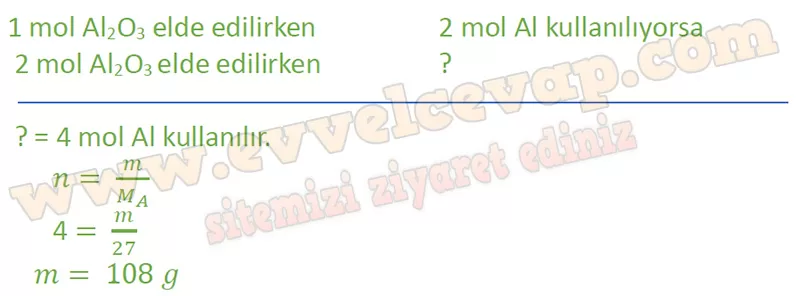
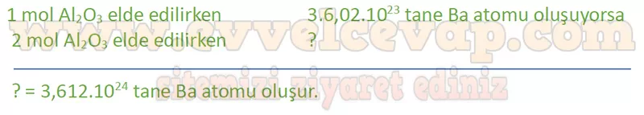
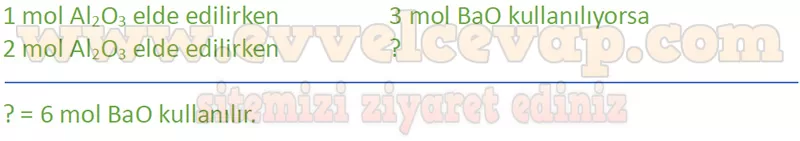

# 10. Sınıf Kimya Ders Kitabı Meb Yayınları Cevapları Sayfa 70

---

**Soru: 5) Ulaştığınız çıkarımı kullanarak aşağıdaki tepkime üzerinde deneyiniz. Alüminyum eritilip katı baryum oksit ile karıştırılarak ısıtılacak olursa şiddetli bir tepkime meydana gelir. Bu tepkime sonucunda erimiş baryum elementi ve katı alüminyum oksit oluşur. 2Al(s) + 3BaO(k) →Al203(k) + 3Ba(s) 2 mol Al203 elde edilirken**

**Soru: Kaç g Al tepkimeye girmiştir? (Al 27 g/mol)**

-   **Cevap**:

**Soru: Kaç tane Ba atomu oluşmuştur?**

-   **Cevap**:

**Soru: Kaç mol BaO kullanılmıştır?**

-   **Cevap**:

**Değerlendirme**

**Soru: 1) Etkinlik sırasında kurmuş olduğunuz genellemeler 5. adımdaki sorunun çözümünde sizi doğru sonuca ulaştırdı mı? Arkadaşlarınızın genellemeleri ile kendi genellemelerinizi karşılaştırınız. Benzer ya da ortak yönleri tartışınız.**

-   **Cevap**: Evet; katsayıların mol oranı olduğunu, bundan kütle ve tanecik hesaplarına geçildiğini kullanınca doğru sonuca ulaştım; arkadaşlarım da aynı oran–mol–kütle/NA zincirini kullandı.

**Soru: 2) Kimyasal hesaplama yapabilmek için hangi bilgilere ihtiyaç duyulur? Yazınız.**

-   **Cevap**: Atom kütlesi, tepkimede harcanan oluşan maddelerin mol sayıları, denkleşmiş tepkime denklemi.