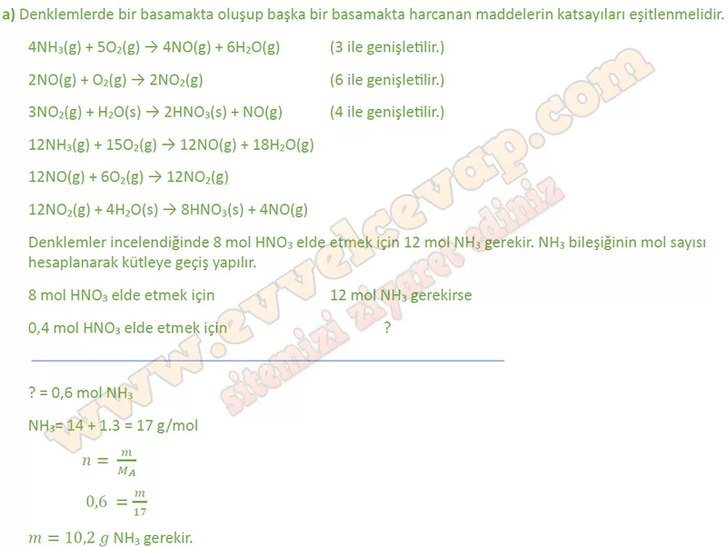
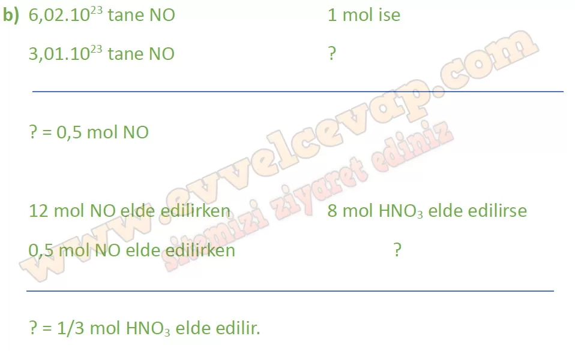
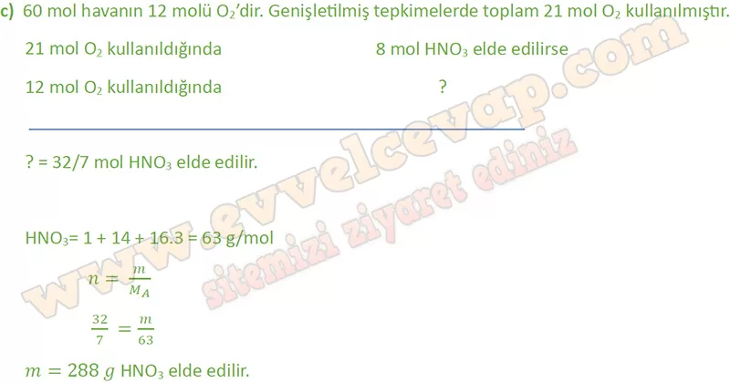
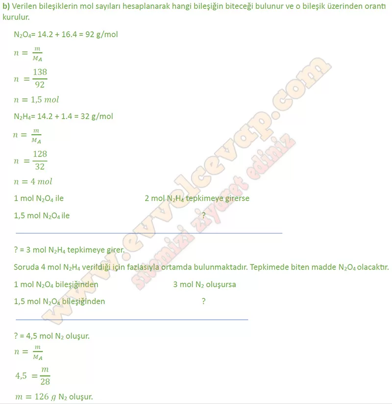

# 10. Sınıf Kimya Ders Kitabı Meb Yayınları Cevapları Sayfa 75

---

**Kontrol Noktası**

Ostwald (Osvalt) süreciyle nitrik asit üretimi için aşağıdaki adımların gerçekleştirilmesi gerekir:

 İlk olarak oksijenle amonyak tepkimeye sokularak azot monoksit elde edilir. Bu tepkime 850 °C sıcaklık, 5 atm basınç ve platin ya da rodyum katalizörlüğünde gerçekleştirilir.

 4NH3(g) + 502(g) 4N0(g) + 6H20(g)

 Azot monoksidin oksijen ile tepkimeye girmesiyle azot dioksit elde edilir.

 2N0(g) + 02(g) → 2N02(g)

 Azot dioksidin su ile tepkimeye girmesiyle nitrik asit elde edilir.

**Soru: a) 0,4 mol HNO 3 elde etmek için tepkime kaç g NH 3 ile başlatılmalıdır? (H: 1 g/mol, N: 14 g/mol)**

-   **Cevap**:

**Soru: b) 3,01 -10 23 tane NO gazı elde edildikten sonra kaç mol HNO 3 elde edilebilir?**

-   **Cevap**:

**Soru: c) İşlem süresince toplam 60 mol hava kullanıldığına göre kaç g HNO 3 elde edilmiştir? (Havanın yaklaşık %20’si oksijendir. H: 1 g/mol, N: 14 g/mol, O: 16 g/mol)**

-   **Cevap**:

**Soru: 2) Hidrazin (N 2 H 4) ve diazot tetroksit (N 2 0 4) karışımı roketlerde yakıt olarak kullanılır. Kapalı kapta N2H4 ve N204 tepkimesinin zamanla mol sayısı değişimi aşağıdaki grafikte verilmiştir: Buna göre**

**Soru: a) N 2 H 4 ve N 2 O 4 arasındaki denkleştirilmiş tepkime denklemini yazınız.**

-   **Cevap**: **2N 2 H 4 + N 2 O 4 → 3N 2 + 4H 2 O**

**Soru: b) 138 g N 2 O 4 ile 128 g N 2 H 4 tepkimesinden tam verimle elde edilen azot gazı kaç g’dır? (H: 1 g/mol, N: 14 g/mol, O: 16 g/mol)**

-   **Cevap**:

**Soru: c) Tepkime denklemini kullanarak b şıkkındaki sınırlayıcı bileşeni belirleyiniz.**

-   **Cevap**: **N 2 O 4**