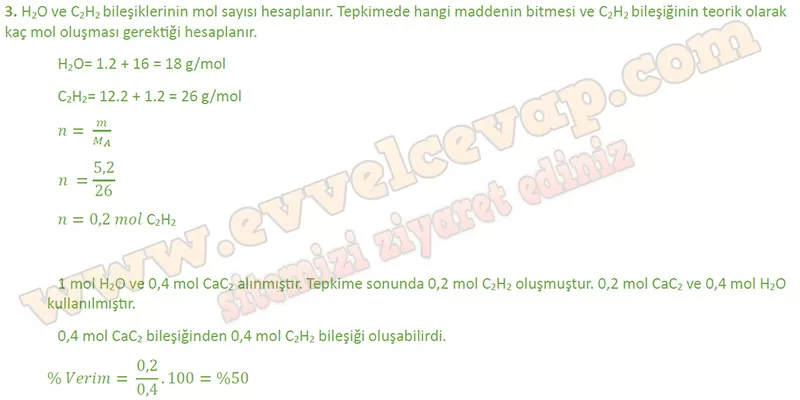
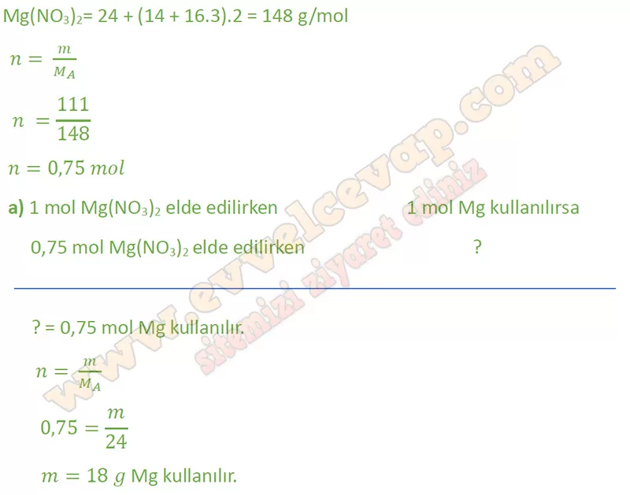
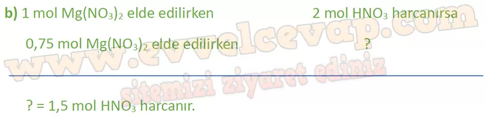
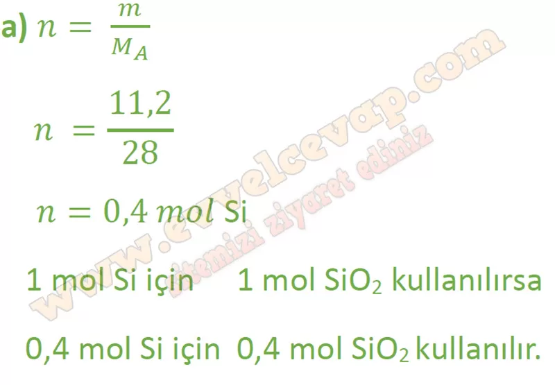
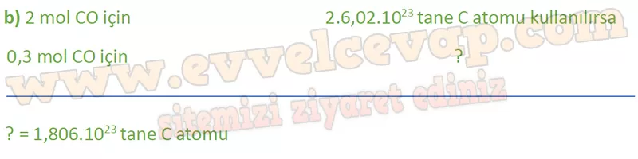

# 10. Sınıf Kimya Ders Kitabı Meb Yayınları Cevapları Sayfa 76

---

**Soru: 3) Kalsiyum karbürden (CaC 2) asetilen gazı (C 2 H 2) eldesine ait denklem aşağıda verilmiştir. CaC 2(k) + 2H 2 0(s) -► Ca(OH)2(k) + C 2 H 2(g) 0,4 mol CaC 2 ve 18 g su kullanılarak 5,2 g asetilen (C 2 H 2) gazı elde ediliyor. Buna göre tepkimenin verimi % kaçtır? (H: 1 g/mol, C: 12 g/mol, O: 16 g/mol, Ca: 40 g/mol)**

-   **Cevap**:

**Soru: 4) Magnezyum elementi, periyodik cetvelin 2A grubunda bulunan bir metaldir. Bu metal, nitrik asitte çözünerek hidrojen gazı oluşturur. Bu olaya ait denklem, Mg(k) + 2HNO 3(suda) —> Mg(NO 3)2(suda) + H 2(g) şeklindedir. Buna göre 111 g Mg(N03)2 elde etmek için;**

**Soru: a) Kaç g Mg harcanmıştır? (N: 14 g/mol, O: 16 g/mol, Mg: 24 g/mol)**

-   **Cevap**:

**Soru: b) Kaç mol nitrik asit harcanmıştır?**

-   **Cevap**:

**Soru: 5) Yüksek saflıktaki silisyum eldesi için 25 °C sıcaklıkta

 Si02(k) + 2C(k) Si(k) + 2CO(g) tepkimesi kullanılır.

 Bu tepkime ile ilgili aşağıda verilen soruları cevaplayınız.**

**Soru: a) 11,2 g Si elde etmek için kaç mol Si0 2 harcanmalıdır? (Si: 28 g/mol)**

-   **Cevap**:

**Soru: b) 0,3 mol CO gazı elde etmek için kaç tane C atomu harcanmalıdır?**

-   **Cevap**:

