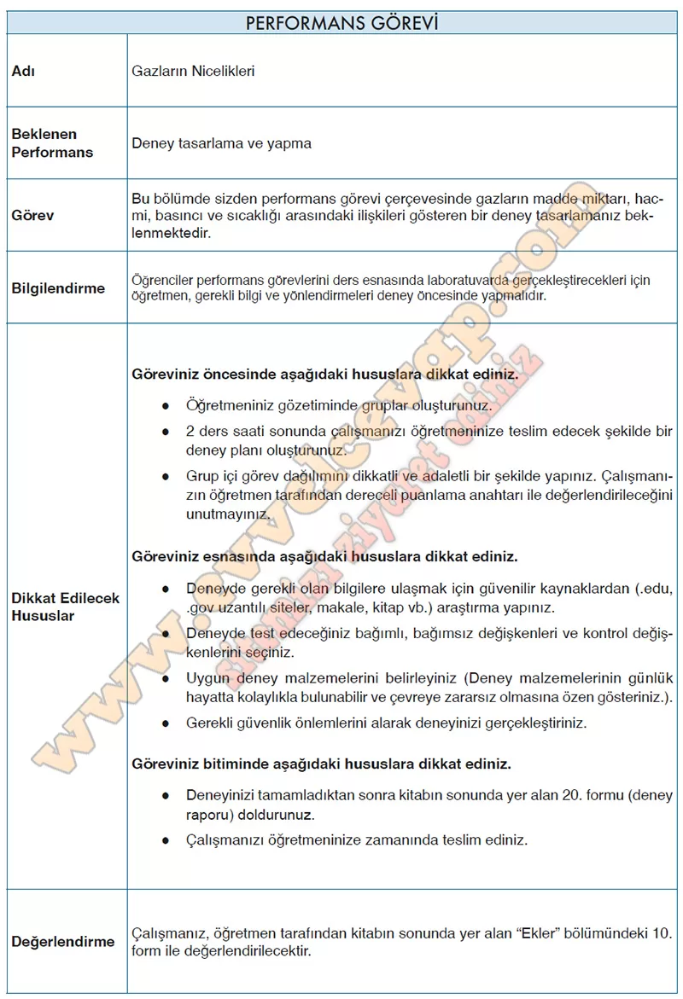

# 10. Sınıf Kimya Ders Kitabı Meb Yayınları Cevapları Sayfa 97

---

-   **Cevap**:

### PERFORMANS GÖREVİ RAPORU

**Adı:** Gazların Nicelikleri

**Amaç:** Gazların basınç, hacim, sıcaklık ve madde miktarı arasındaki ilişkileri gözlemlemek.

### Deney Planı

**Kullanılacak Malzemeler:**

-   Şırınga (pistonlu, 60 mL)

-   Su dolu beher

-   Termometre

-   Lastik balon

-   Isıtıcı (sıcak su) ve soğutucu (buzlu su)

-   Kronometre

**Bağımlı Değişken:** Gazın basıncı veya hacmi

**Bağımsız Değişken:** Sıcaklık (°C) veya hacim (mL)

**Kontrol Değişkenleri:** Gaz türü (hava), kullanılan kap, deney süresi

### Deneyin Yapılışı

1.   Şırıngayı 30 mL havayla doldur ve ucu kapat.

2.   Şırıngayı önce oda sıcaklığındaki suya daldır, pistonun hareketini gözlemle.

3.   Şırıngayı sıcak suya koy, hacimdeki değişimi kaydet.

4.   Aynı şırıngayı buzlu suya koy, hacimdeki değişimi gözlemle.

5.   Balonu şişir, oda sıcaklığında ölç. Daha sonra sıcak suya ve buzlu suya koyarak hacim değişimlerini karşılaştır.

### Gözlemler

-   Sıcak suya konulduğunda şırınga pistonu dışarı doğru hareket etti, hacim arttı.

-   Buzlu suda piston içeri doğru hareket etti, hacim azaldı.

-   Balon sıcak suda büyüdü, buzlu suda küçüldü.

### Sonuç

-   Gazların **hacmi sıcaklıkla doğru orantılıdır** (Charles Yasası).

-   Basınç sabitken sıcaklık artarsa hacim artar, sıcaklık azalırsa hacim küçülür.

-   İdeal gaz denklemi P⋅V=n⋅R⋅T ile sonuçlar uyumludur.