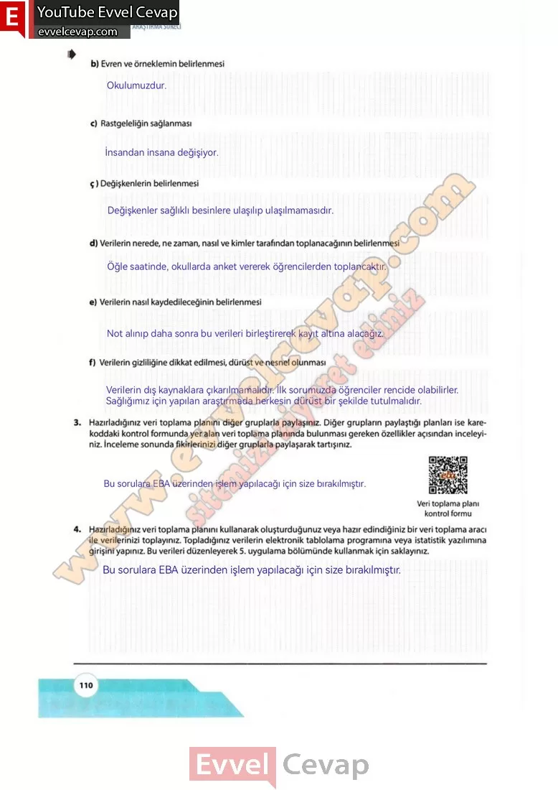

# 10. Sınıf Matematik Kitabı Cevapları Meb Yayınları Sayfa 110

---

**Soru:****b) Evren ve örneklemin belirlenmesi**

**Soru: c) Rastgeleliğin sağlanması**

**Soru: ç) Değişkenlerin belirlenmesi**

**Soru: d) Verilerin nerede, ne zaman, nasıl ve kimler tarafından toplanacağının belirlenmesi**

**Soru: e) Verilerin nasıl kaydedileceğinin belirlenmesi**

**Soru: f) Verilerin gizliliğine dikkat edilmesi, dürüst ve nesnel olunması**

**Soru: 3) Hazırladığınız veri toplama planını diğer gruplarla paylaşınız. Diğer grupların paylaştığı planları ise kare- koddaki kontrol formunda yer alan veri toplama planında bulunması gereken özellikler açısından inceleyiniz. İnceleme sonunda fikirlerinizi diğer gruplarla paylaşarak tartışınız.**

**Soru: 4) Hazırladığınız veri toplama planını kullanarak oluşturduğunuz veya hazır edindiğiniz bir veri toplama aracı ile verilerinizi toplayınız. Topladığınız verilerin elektronik tablolama programına veya istatistik yazılımına girişini yapınız. Bu verileri düzenleyerek 5. uygulama bölümünde kullanmak için saklayınız.**

-   **Cevap**:

