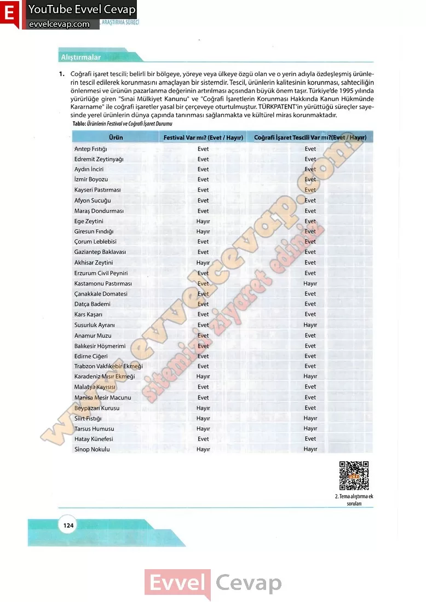

# 10. Sınıf Matematik Kitabı Cevapları Meb Yayınları Sayfa 124

---

**Alıştırmalar**

**Soru: 1)**Coğrafi işaret tescili; belirli bir bölgeye, yöreye veya ülkeye özgü olan ve o yerin adıyla özdeşleşmiş ürünlerin tescil edilerek korunmasını amaçlayan bir sistemdir. Tescil, ürünlerin kalitesinin korunması, sahteciliğin önlenmesi ve ürünün pazarlanma değerinin artırılması açısından büyük önem taşır.**Türkiye’de 1995 yılında yürürlüğe giren “Sınai Mülkiyet Kanunu” ve “Coğrafi İşaretlerin Korunması Hakkında Kanun Hükmünde Kararname” ile coğrafi işaretler yasal bir çerçeveye oturtulmuştur. TÜRKPATENT’in yürüttüğü süreçler sayesinde yerel ürünlerin dünya çapında tanınması sağlanmakta ve kültürel miras korunmaktadır.**

-   **Cevap**:

