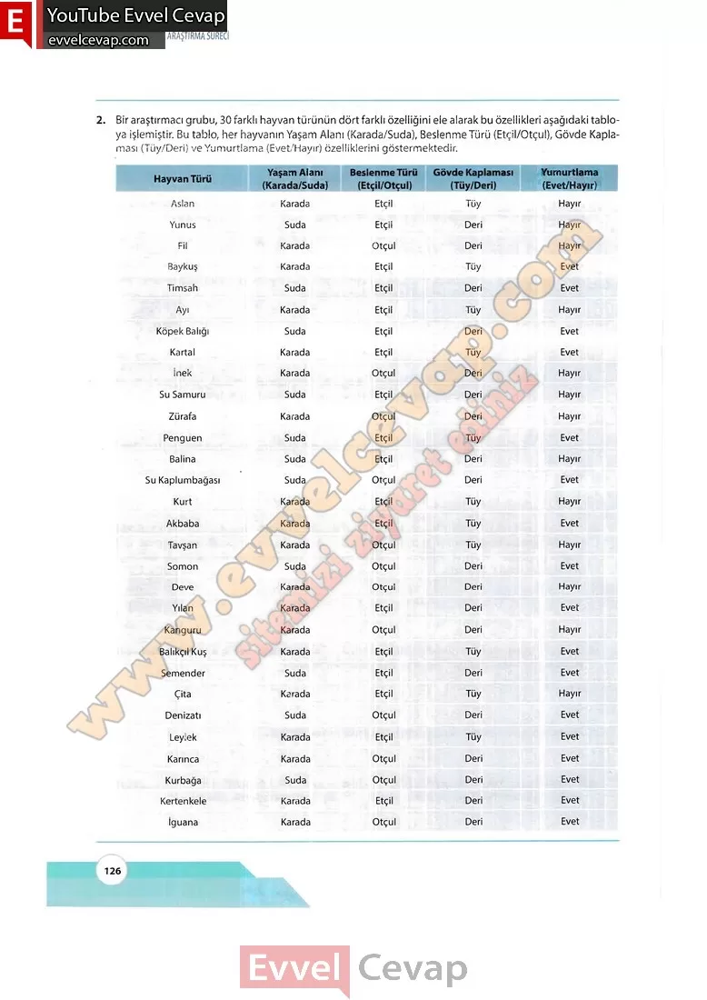

# 10. Sınıf Matematik Kitabı Cevapları Meb Yayınları Sayfa 126

---

**Soru: 2) Bir araştırmacı grubu, 30 farklı hayvan türünün dört farklı özelliğini eie alarak bu özellikleri aşağıdaki tabloya işlemiştir. Bu tablo, her hayvanın Yaşam Alanı (Karada/Suda), Beslenme Türü (Etçil/Otçul), Gövde Kaplaması (Tüy/Deri) ve Yumurtlama (Evet/Hayır) özelliklerini göstermektedir.**

-   **Cevap**:

