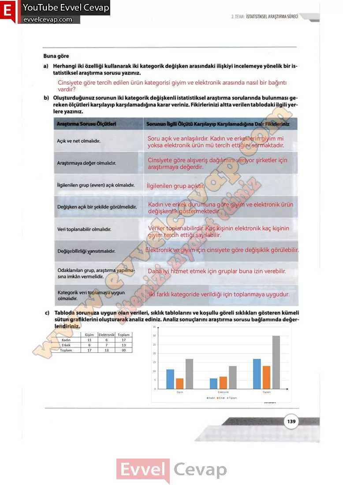

# 10. Sınıf Matematik Kitabı Cevapları Meb Yayınları Sayfa 139

---

**Soru: a) Herhangi iki özelliği kullanarak iki kategorik değişken arasındaki ilişkiyi incelemeye yönelik bir istatistiksel araştırma sorusu yazınız.**

**Soru: b) Oluşturduğunuz sorunun iki kategorik değişkenli istatistiksel araştırma sorularında bulunması gereken ölçütleri karşılayıp karşılamadığına karar veriniz. Fikirlerinizi altta verilen tablodaki ilgili yerlere yazınız.**

Açık ve net olmalıdır.

 Araştırmaya değer olmalıdır.

 İlgilenilen grup (evren) açık olmalıdır.

 Değişken açık bir şekilde görülmelidir.

 Veri toplanabilir olmalıdır.

 Değişebilirliği yansıtmalıdır.

 Odaklanılan grup, araştırma yapılmasına imkân vermelidir.

 Kategorik veri toplamaya uygun olmalıdır.

**Soru: c) Tabloda sorunuza uygun olan verileri, sıklık tablolarını ve koşullu göreli sıklıkları gösteren kümeli sütun grafiklerini oluşturarak analiz ediniz. Analiz sonuçlarını araştırma sorusu bağlamında değerlendiriniz.**

-   **Cevap**:

