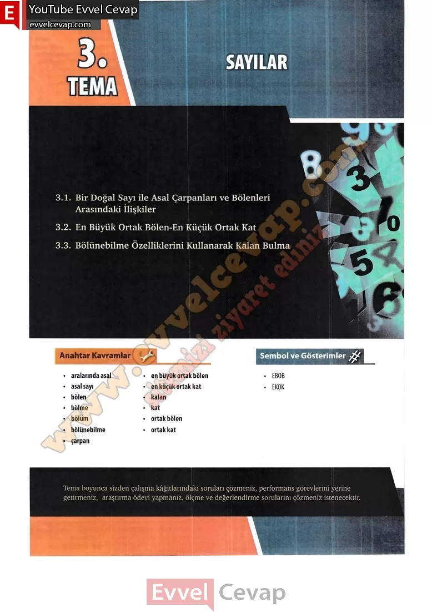

# 10. Sınıf Matematik Kitabı Cevapları Meb Yayınları Sayfa 140

---

3.1. Bir Doğal Sayı ile Asal Çarpanları ve Bölenleri Arasındaki İlişkiler

 3.2. En Büyük Ortak Bölen-En Küçük Ortak Kat

 3.3. Bölünebilme Özelliklerini Kullanarak Kalan Bulma

**Anahtar Kavramlar**

• aralarında asal

 • asal sayı

 • bölen

 • bölme

 • bölüm

 • bölünebilme

 • çarpan

 • en büyük ortak bölen

 • en küçük ortak kat

 • kalan

 • kat

 • ortak bölen

 • ortak kat

-   **Cevap**:**Bu sayfada soru bulunmamaktadır.**

