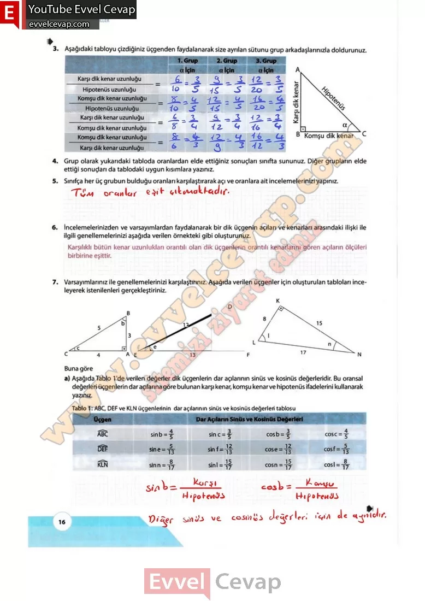

# 10. Sınıf Matematik Kitabı Cevapları Meb Yayınları Sayfa 16

---

**Soru: b) Aşağıda Tablo 2’de verilen değerler dik üçgenlerin dar açılarının tanjant ve kptanjant değerleridir. Bu oransal değerleri üçgenlerin dar açılarına göre bulunan karşı kenar, komşu kenar ve hipotenüs ifadelerini kullanarak yazınız.**

**Soru: 8) Genellemenizden yola çıkarak dik üçgende bir dar açıya göre kenar uzunluklarının öranrnallişkin önermenizi aşağıda verilen örnekteki gibi yazınız.**

**Soru: 9)**Oluşturduğunuz önermeler yardımıyla aşağıda verilen problemi çözünüz. Aşağıdaki görselde çeşitli spor müsabakalarının yapıldığı bir spor merkezindeki toplanma alanlarının görseli verilmiştir. Spor merkezine dik üçgen şeklinde iki adet toplanma alanı yapılıyor.**Her iki toplanma alanının dar açılarından birinin ölçüsü a dır. Toplanma alanlarından bir tanesinin dik kenar uzunlukları 3 vç 6 rinetre, diğer, toplanma alanının dik kenar uzunlukları 8 ve x metredir. Buna göre x değerini bulunuz.**

-   **Cevap**:

