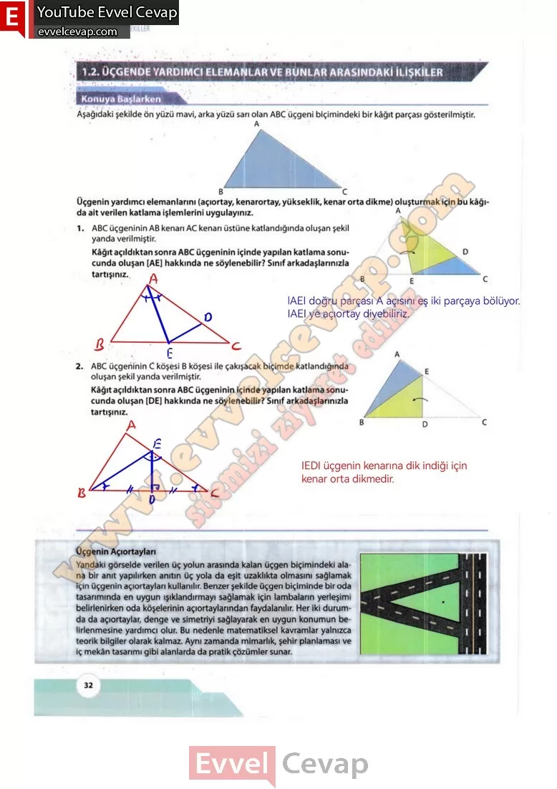
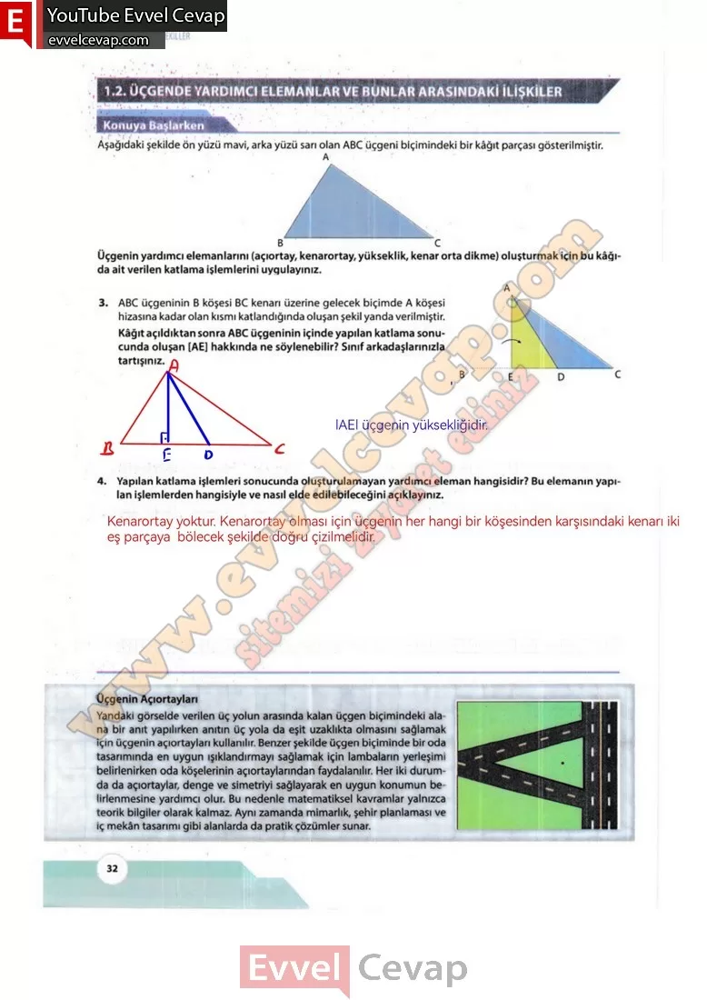

# 10. Sınıf Matematik Kitabı Cevapları Meb Yayınları Sayfa 32

---

**Konuya Başlarken**

**Soru: Aşağıdaki şekilde ön yüzü mavi, arka yüzü sarı olan ABC üçgeni biçimindeki bir kâğıt parçası gösterilmiştir. Üçgenin yardımcı elemanlarını (açıortay, kenarortay, yükseklik, kenar orta dikme) oluşturmak için bu kâğıda ait verilen katlama işlemlerini uygulayınız.**

**Soru: 1) ABC üçgeninin AB kenarı AC kenarı üstüne katlandığında oluşan şekil yanda verilmiştir. Kâğıt açıldıktan sonra ABC üçgeninin içinde yapılan katlama sonucunda oluşan [AE] hakkında ne söylenebilir? Sınıf arkadaşlarınızla tartışınız..**

**Soru: 2) ABC üçgeninin C köşesi B köşesi ile çakışacak biçimde katlandığında oluşan şekil yanda verilmiştir. Kâğıt açıldıktan sonra ABC üçgeninin içinde yapılan katlama sonucunda oluşan [DE] hakkında ne söylenebilir? Sınıf arkadaşlarınızla tartışınız.**

**Soru: 3) ABC üçgeninin B köşesi BC kenarı üzerine gelecek biçimde A köşesi hizasına kadar olan kısmı katlandığında oluşan şekil yanda verilmiştir. Kâğıt açıldıktan sonra ABC üçgeninin içinde yapılan katlama sonucunda oluşan [AE] hakkında ne söylenebilir? Sınıf arkadaşlarınızla tartışınız.**

**Soru: 4) Yapılan katlama işlemleri sonucunda oluşturulamayan yardımcı eleman hangisidir? Bu elemanın yapılan işlemlerden hangisiyle ve nasıl elde edilebileceğini açıklayınız.**

**Üçgenin Açıortayları**

 Yandaki görselde verilen üç yolun arasında kalan üçgen biçimindeki alana bir anıt yapılırken anıtın üç yola da eşit uzaklıkta olmasını sağlamak için üçgenin açıortayları kullanılır. Benzer şekilde üçgen biçiminde bir oda tasarımında en uygun ışıklandırmayı sağlamak için lambaların yerleşimi belirlenirken oda köşelerinin açıortaylarından faydalanılır. Her iki durumda da açıortaylar, denge ve simetriyi sağlayarak en uygun konumun belirlenmesine yardımcı olur. Bu nedenle matematiksel kavramlar yalnızca teorik bilgiler olarak kalmaz. Aynı zamanda mimarlık, şehir planlaması ve iç mekân tasarımı gibi alanlarda da pratik çözümler sunar.

-   **Cevap**:

