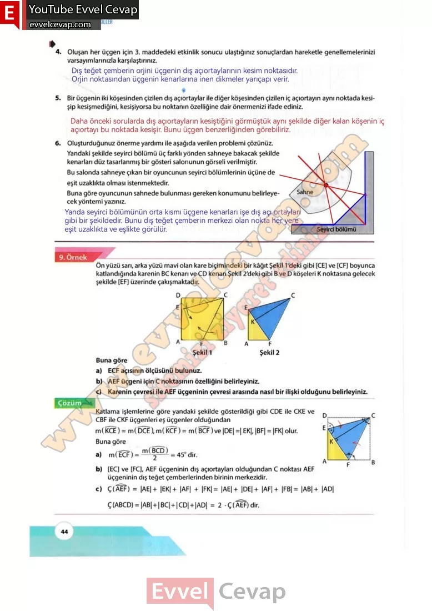

# 10. Sınıf Matematik Kitabı Cevapları Meb Yayınları Sayfa 44

---

**Soru: 4) Oluşan her üçgen için 3. maddedeki etkinlik sonucu ulaştığınız sonuçlardan hareketle genellemelerinizi varsayımlarınızla karşılaştırınız.**

**Soru: 5) üçgenin iki köşesinden çizilen dış açıortaylar ile diğer köşesinden çizilen iç açıortayın aynı noktada kesişip kesişmediğini, kesişiyorsa bu noktanın özelliğine dair önermenizi ifade ediniz.**

**Soru: 6) Oluşturduğunuz önerme yardımı ile aşağıda verilen problemi çözünüz. Yandaki şekilde seyirci bölümü üç farklı yönden sahneye bakacak şekilde kenarları düz tasarlanmış bir gösteri salonunun görseli verilmiştir. Bu salonda sahneye çıkan bir oyuncunun seyirci bölümlerinin üçüne de eşit uzaklıkta olması istenmektedir. Buna göre oyuncunun sahnede bulunması gereken konumunu belirleyecek yöntemi yazınız.**

-   **Cevap**:

