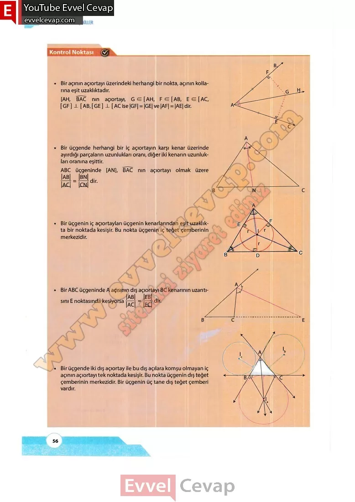

# 10. Sınıf Matematik Kitabı Cevapları Meb Yayınları Sayfa 56

---

**Kontrol Noktası**

Bir açının açıortayı üzerindeki herhangi bir nokta, açının kollarına eşit uzaklıktadır.

 Bir üçgende herhangi bir iç açıortayın karşı kenar üzerinde ayırdığı parçaların uzunlukları oranı, diğer iki kenarın uzunlukları oranına eşittir.

 Bir üçgenin iç açıortayları üçgenin kenarlarından eşit uzaklıkta bir noktada kesişir. Bu nokta üçgenin iç teğet çemberinin merkezidir.

 Bir üçgende iki dış açıortay ile bu dış açılara komşu olmayan iç açının açıortayı tek noktada kesişir. Bu nokta üçgenin dış teğet çemberinin merkezidir. Bir üçgenin üç tane dış teğet çemberi vardır.

-   **Cevap**:**Bu sayfada soru bulunmamaktadır.**

